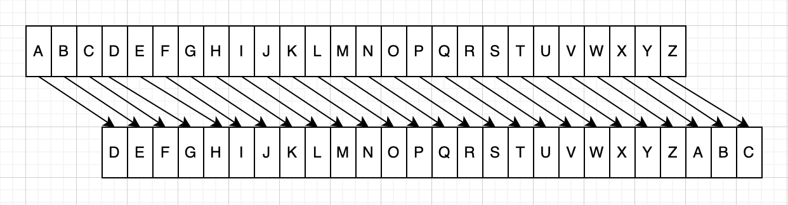
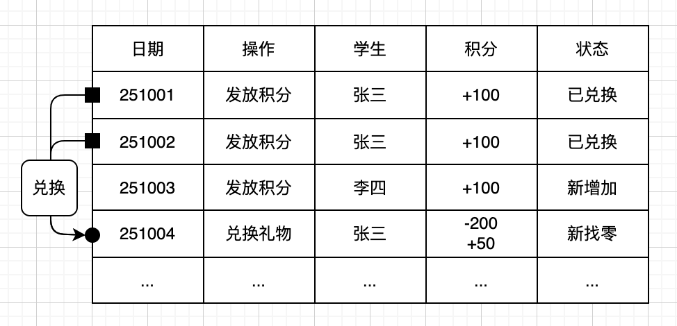
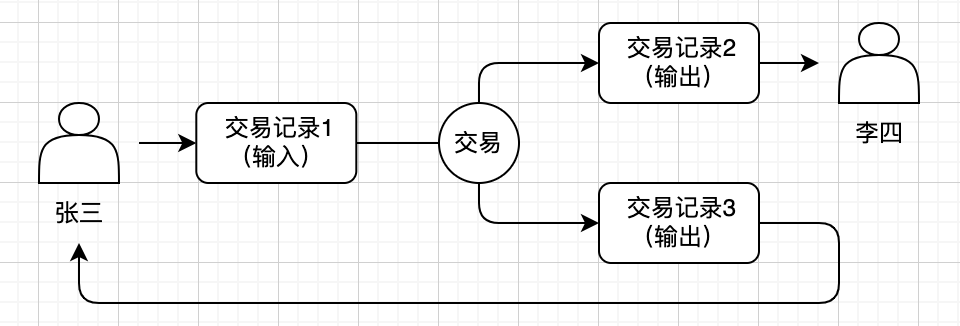
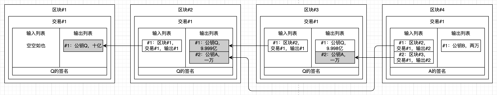
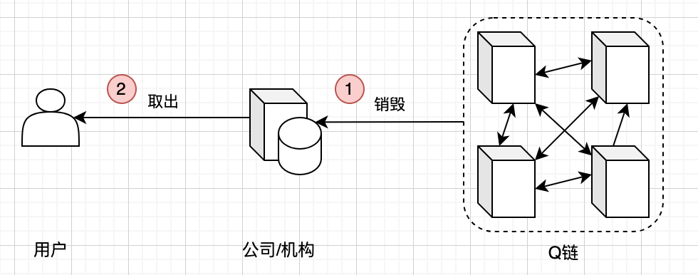

# 人人能懂的区块链

> 版本：2025.11.01

免责声明：这本书目前还处于草稿阶段，且大部分内容是在十天里（2025年国庆节假期）赶工完成的，因此可能存在语言表述稍显杂乱、部分内容不够准确等情况，还请大家多包涵！如果你在阅读中发现问题，或是有改进建议，欢迎随时通过我的Web3邮箱与我沟通，非常感谢大家的支持和反馈。邮箱地址：

```
0x8f7bee940b9f27e8d12f6a4046b9ec57c940c0fa@dmail.ai
```

区块链本身挺复杂的，一本书肯定没法把所有内容都讲透，所以这本书也只是管中窥豹，很多知识点都没覆盖到。但如果觉得这本书写得还不错，或者多少帮到了你，愿意的话可以请我喝杯奶茶。你的鼓励对我来说特别重要，也是我继续完善这本书的动力，下面是我的EVM地址：

```
0x8f7BEE940b9F27E8d12F6a4046b9EC57c940c0FA
```

<div style="page-break-after: always;"></div>

## 目录

[toc]

<div style="page-break-after: always;"></div>

## 前言

一直以来，我都想把自己这些年学习区块链的心得与理解整理成一本书，用更系统的方式表达出来，和大家分享。但此前总苦于找不到清晰的思路，不知道该从哪个角度切入。如果从代码或技术细节动笔，市面上已有不少像《精通比特币》、《精通以太坊》这样的优秀书籍，我很难超越。而且这类书对读者的技术背景要求很高，普通人很难读懂。可若只从应用层面展开，又觉得内容太空泛，难以深入展开讨论。直到最近，向我咨询区块链相关概念的非技术朋友越来越多。他们对区块链知识的迫切渴求，不仅重新点燃了我的写作欲望，也让我突然找到了方向：写一本普通人也能读懂的区块链书。

这本书是写给“普通人”看的，那该怎么定义“普通人”呢？其实很简单：如果你不是计算机专业或数学系出身，也不懂电脑编程，但具备初中到高中的基本数学知识，那你就是我口中的“普通人”。没错，只要你有这份基础数学能力，就能看懂十六进制；看懂了十六进制，就能理解哈希算法与数字签名；理解了这些底层技术，就能进一步搞懂区块链的核心原理；而掌握了区块链原理后，稳定币的设计逻辑、各类DeFi协议的底层机制，自然也能慢慢理清。总之，其实普通人也能一步步吃透区块链。

我一直想试试：不涉及代码，也不深挖复杂算法，只以极少数必要的“黑盒子”作为知识基础，能不能把区块链的整个体系讲明白。我不确定自己最终能不能做到，但我决定挑战一次，于是就有了你眼前这本书。如果你翻开这本书时的心情，和我写下这些内容时一样激动，那就做好准备，跟着我一起开启这场“读懂区块链”的挑战吧！


### 目标读者

本书主要面向两类读者。第一类是常接触Web3应用（如各类DApp、DeFi平台），但对区块链底层逻辑和运行原理了解不深，希望进一步深入理解相关概念的读者。通过本书能系统梳理底层知识，打通“应用使用”与“原理认知”的断层。第二类是尚未实际使用过区块链产品，却频繁听到地址、钱包、智能合约、PoW、NFT、DApp、DeFi、Web3等高频概念，渴望理清这些术语含义的读者。借助本书对核心概念的拆解与讲解，可快速建立对Web3生态的基础认知，为后续真正进入Web3领域做好知识准备。

本书的定位并非“实操指南”，它不会教你如何开展区块链相关的具体操作，比如创建钱包、发起转账、参与挖矿等。如果你想学习这类“怎么做（How）”的实用技能，恐怕无法从本书中获得直接帮助。它聚焦于更底层的“是什么（What）”与“为什么（Why）”，比如区块链的核心逻辑是什么、分布式共识机制为什么能保障安全、交易背后的加密原理为何成立。如果你希望跳出“只会操作”的层面，深入理解每一步实际行为背后的技术逻辑与设计初衷，搞懂“操作之外的底层逻辑”，那么本书会是更适合你的选择。


### 如何阅读

考虑到本书内容围绕区块链基础概念到一些重要DeFi协议协议原理逐步展开，各章节间存在一定的逻辑衔接，因此建议读者优先从头到尾按顺序阅读，这样能更连贯地理解从底层逻辑到具体应用的知识脉络，避免因跳过前置内容导致对后续知识点的理解断层。当然，若你已具备一定的区块链基础，对部分基础概念（如区块链本质、钱包原理等）已有了解，也可以根据自身需求选择性进入特定章节开始阅读，比如直接聚焦工作量证明、多签交易、智能合约等你更关注的内容，灵活匹配自身的知识补充需求。


### 主要内容

为帮助读者循序渐进地理解区块链，本书并未直接堆砌复杂的技术概念，而是以虚拟的Q公司为场景载体，通过讲述一条简化版“Q链”的完整进化路径展开：我们从最基础的传统数据库模式切入，模拟Q公司在数据记录、流转中遇到的痛点，再顺着“解决问题”的逻辑，逐步将数字签名（保障身份可信）、UTXO模型（规范资产流转）、哈希锁链（确保数据不可篡改）、工作量证明（实现去中心化确权）、共识算法（协调节点一致性）及智能合约（拓展自动化功能）等核心概念融入Q链的迭代中，让读者随Q链的进化自然掌握区块链的底层逻辑。

本书的内容大致分为三个部分。第一部分为前置基础知识，包含两章内容。其中第一章聚焦哈希算法与数字签名这两个区块链技术的核心“黑盒子”，通过通俗解读帮读者建立底层认知。第二章的主要作用是引出虚拟的游戏公司Q作为讲解载体，为后续内容铺垫场景。第二部分主体围绕区块链1.0展开，系统介绍地址与密钥的核心概念、UTXO模型、PoW机制与共识算法、区块链的链式结构，以及多签交易等关键知识点。第三部分聚焦区块链2.0时代，深入讲解智能合约的原理与作用，以及基于智能合约开发的各类DApp的特点与应用逻辑。下面是详细的内容：

* 第一部分：前置知识
  * 第零章：最少量的基础知识。主要讲解哈希函数与数字签名这两个底层核心算法，为后续区块链相关内容打下认知基础。
  * 第一章：从游戏币开始说起。主要介绍虚拟游戏公司Q的设定，通过具体场景为后续区块链原理的讨论铺垫，降低理解门槛。

* 第二部分：区块链`1.0`
  * 第二章：把密码替换成密钥。主要介绍数字签名的实际应用场景，同时详解密钥与钱包的核心概念及关联逻辑。
  * 第三章：让数据审计变容易。主要对比不同记账模式的特点，重点讲解UTXO模型的原理与优势，说明其如何简化数据审计。
  * 第四章：让数据篡改变困难。主要介绍工作量证明机制与哈希锁的作用，进而引出区块链的核心定义与链式结构特性。
  * 第五章：把账本变成分布式。主要讲解共识协议的原理与价值，阐明区块链如何实现账本的分布式存储，以及去中心化的具体体现。
  * 第六章：处理更复杂的交易。主要介绍多签交易的应用场景，同时讲解脚本与虚拟机的基础概念，说明其对复杂交易的支撑作用。

* 第三部分：区块链`2.0`
  * 第七章：从应用升级为平台。主要介绍图灵完备虚拟机的特性，以及智能合约的基本概念与工作原理，说明区块链如何从单一应用升级为开发平台。
  * 第八章：稳定币和链上资产。主要梳理各类链上代币的应用类型，重点讲解稳定币的设计逻辑、分类及核心价值。
  * 第九章：浅谈自动做市协议。主要介绍恒定乘积型自动做市协议的核心原理，同时分析其潜在风险与应对思路。
  * 第十章：浅谈链上借贷协议。主要介绍基于超额抵押机制的链上借贷逻辑，详解清算机制的作用与运作流程。

* 结束语。总结全书核心知识点，梳理从区块链1.0到2.0的技术演进脉络，同时对区块链技术的未来发展方向进行展望。

* 附录A：术语表。本附录汇总全书涉及的核心术语，涵盖中英文对照，方便读者快速查阅。


### 由衷致谢

首先要深深感谢中本聪（Satoshi Nakamoto），正是这位神秘人物发明了区块链。若没有这一底层技术，不仅没有如今蓬勃发展的Web3生态，也不会有这本书。接着要感谢豆包AI，每当我写作陷入瓶颈、思路卡顿的时候，是它帮我梳理逻辑、提供灵感，让文字（包括这个致谢）能顺畅推进。它还帮我检查出了书中大部分的错别字。还要感谢ChatGPT，本书每一章开头的配套图片都由它生成。不过我不太擅长写精准的提示词，要是图片效果未达预期，责任全在我，与它无关。同样要感谢Drawio的开发人员，这款工具既强大又免费，本书里所有的示意图都是用它绘制的，帮我解决了可视化表达的难题。另外，虽然我不知道Markdown的发明者是谁，但必须致谢。这种格式简洁又高效，实在太好用了，本书全程用Typora软件（已付费）搭配Markdown格式完成编写。也得感谢林纳斯・托瓦兹（Linus Torvalds）开发了Git，正是靠它的版本控制功能，本书的草稿迭代、内容修改才得以有序管理。最后，要特别感谢早期帮我审核初稿的朋友们，从内容准确性到表述流畅度，他们都提出了很多宝贵建议，这本书的完成离不开每个人的支持和帮助。谢谢大家。

<div style="page-break-after: always;"></div>

## 第零章：最少量的基础知识


和所有介绍区块链原理的书一样，读懂本书也需要一些数学、密码学、计算机等方面的基础。但是作为普通人的我们，可能并没有这么多的学问，甚至连中学时代学过的数学课程也都快忘光了。不过不用担心，本书经过了精心设计，会尽量避开那些高深的知识，如果实在避免不了，我会用黑盒子来代替。

所谓黑盒子，你只要知道它能干些什么就行，完全不用管它内部是怎样工作的。举个例子，我们平时使用的电视机遥控器就是一个黑盒子（虽然它有可能是白色的）。我们只要知道按下某个按钮可以换台调音量就可以了，至于它内部有哪些零件，是怎么起作用的，都不需要知道。生活中这样的例子比比皆是，我们离不开各种各样的黑盒子。

本书用到的最重要的黑盒子就两个：哈希函数（Hash Function）和数字签名（Digital Signature）。本章会介绍这两个黑盒子能做一些什么样的事情，但是不会讲它们的工作原理。如果你对它们的内部工作原理感兴趣，可以找一些现代密码学的入门书来看一看。但是即使是只想了解这两个黑盒子的行为，也必须懂二进制和十六进制，以及数据的编码和解码。我相信大部分人都是可以理解这些内容的，我们从不同的进位系统开始说起。


### 十六进制

由于人类有十根手指头，所以我们认为十进制（Decimal，简称Dec）计数系统是非常自然的事情。现在我们来想象一下另外两个出现了文明的星球，其中一个星球上的人每双手只有两个指头，而另外一个星球上的人每双手有多达十六个指头。

对于两指星人来说，二进制（Binary，简称Bin）才是最合适的计数系统，他们只需要`0`和`1`两个数字就够了。但是对于十六指星人来说，显然十六进制（Hexadecimal，简称Hex）才是最舒服的计数系统，也就是说需要十六个数字。由于我们不了解这个外星文明，所以也不知道他们的数字到底长啥样。不妨假设他们也懂阿拉伯数字和英文字母，于是我们可以用`0`到`9`和`a`到`f`来表示从零到十五这十六个数字。简单来说就是，数字不够，字母来凑，如下图所示：


好的，二进制和十六进制已经讲完了。如果你还是不懂，可以打开你最喜欢的搜索引擎或者聊天机器人，再学习一番，然后回到本书。（一段时间以后）OK，你懂了，那我们继续学习。

无论是二、十还是十六进制系统，它们的表达能力是一样的。任何的数据都可以用任何一种进制系统来表达，而且相互之间也可以转换。打个比方，“你好”可以用中文、英文，或者世界上任何一个国家的文字系统来表达，而且可以相互翻译也不会丢失信息。以最简单的整数为例，下表列出了五个我们比较熟悉的整数以及它们的十六进制和二进制表示：

| 十进制     | 十六进制     | 二进制                           |
| ---------- | ------------ | -------------------------------- |
| `12`       | `0x0c`       | `0b1100`                         |
| `100`      | `0x64`       | `0b01100100`                     |
| `255`      | `0xff`       | `0b11111111`                     |
| `2025`     | `0x07e9`     | `0b011111101001`                 |
| `21000000` | `0x01406f40` | `0b0001010000000110111101000000` |

在本书中，我们按照惯例通过增加前缀来区分二、十和十六进制整数。十进制整数就是我们熟悉的写法，不带任何前缀。二进制整数会带上`0b`前缀，十六进制的整数会带上`0x`前缀。另外，十六进制整数里面的字母通常会写成小写，但有时候也会大写，甚至大小写混合，同一个字母无论大小写表达的数字都是一样的。

此时你可能会有一个问题，既然我们已经非常习惯十进制进位系统了，它也足够用，那么干嘛还要伤脑筋去学习二进制和十六进制呢？我们也不打算去这两个星球旅行。答案是，因为我们所使用的电子计算机更喜欢二进制和十六进制。

在计算机里，信息是用二进制来表示的。任何的数据，在计算机看来都是一长串的`0`和`1`。我们可以粗略地认为计算机内部有许许多多微小的电子开关，关闭表示`0`，打开表示`1`。计算机存储信息的最小单位就是这种开关，每一个开关叫做一个比特（Bit）。你肯定听说过大名鼎鼎的比特币（Bitcoin），现在你至少应该理解它的字面含义了吧。它内在的奥秘我会慢慢揭晓。

话说回来，比特这个单位实在太小了，对我们人类并不是很友好，所以通常我们会把每八个比特分成一个小组，叫做一个字节（Byte）。下面这幅图展示了比特和字节的关系：


为什么是八个比特一组，而不是七个、九个、十个呢？这其实是个历史问题，这里就不展开讨论了。总之，一个字节包含八个比特，刚好可以用两个十六进制数字来表示（`0x00`～`0xff`）。所以我们在表示数据的时候，往往更倾向于写成十六进制，而不是二进制（写出来太长了）或者十进制（不好区分字节边界），这样读起来更容易一些。比如上图表示的数据，可以用十六进制表示为`0x8f7bee94`，一眼就可以看出有几个字节。但是如果用十进制表示成`2407263892`，就没那么直观了。


### 编码解码

细心的读者可能已经发现了，同样的数据用二进制表示最长，其次是十进制，再次是十六进制。既然如此，能不能用更大的进位系统让数据看起来更短呢？这听起来挺合情合理，毕竟英文有二十六个字母，而十六进制才用去六个。答案是肯定的。这种将数据按特定规则转换为某种形式的过程称为编码（Encoding），而将编码后的形式还原回原始数据的过程则称为解码（Decoding）。

除了前面提到的Hex等，目前已经有很多标准的编码方式了，例如Base32（使用三十二进制）和Base64（使用六十四进制）。下面这张表列出了同样一份数据使用不同编码方式编码后的结果：

| 进位制     | 编码方式 | 数据                                                    |
| ---------- | -------- | ------------------------------------------------------- |
| 二进制     | 二进制   | `10001111011110111110111010010100...`（太长了，写不下） |
| 十进制     | 十进制   | `819149454988518274463132003182239727525499551994`      |
| 十六进制   | Hex      | `8f7bee940b9f27e8d12f6a4046b9ec57c940c0fa`              |
| 三十二进制 | Base32   | `R5565FALT4T6RUJPNJAENOPMK7EUBQH2`                      |
| 五十八进制 | Base58   | `2zwYyPgJ9hNWDq9ajoctKKxCk5vZ`                          |
| 六十四进制 | Base64   | `j3vulAufJ+jRL2pARrnsV8lAwPo=`                          |

如果你不懂这些编码方式是怎么把数据编码成最右列这样的，也没有关系，把它们当成黑盒子就好了。我们只要理解编码和解码是一对儿互逆的过程，一份数据经过编码之后得到另一份数据，解码后又回得到原来那份数据，如下图所示：


注意看上面的图，如果我们对一份数据进行（例如Base64）编码，我们必须使用同样的编码方式（Base64）对编码后的数据进行解码才能得到原始数据，否则我们得到的就是另外一份没有意义的数据。另外，虽然有时候编码后的确可以让数据看起来更小一点，但通常我们的目的并不是这个。如果想把数据缩小，可以用专门的压缩算法，如下图所示：


### 加密解密

无论是对数据进行编码还是压缩，我们的意图都不是防止别人解码或者解压缩数据。如果想要达到保密的效果，我们需要使用专门的加密算法来加密数据。加密算法听起来很难懂，实际上很容易理解。

以最古老的加密算法之一，凯撒加密算法（起源于古罗马凯撒大帝时期）为例。比如说我们想把`BLOCKCHAIN`加密，我们可以把每个字母都偏移`3`，加密之后得到`EORFNFKDLQ`。拿到加密消息之后，只要反过来对字母做变换就可以得到原始消息。这个加密算法很简单，只是把字母`A`变成`D`,`B`变成`E`，`C`变成`F`，...，`X`变成`A`，`Y`变成`B`，`Z`变成`C`，如下图所示：



在密码学中，我们把加密前的数据叫做明文（Plaintext），把加密后的数据叫做密文（Cyphertext）。像上面凯撒加密算法里，加密（Encrypt）是把每个字母右移`3`，解密（Decrypt）是把每个字母左移`3`。这里`3`必须严格保密才行，否则其他人就可以轻易破解你的消息，我们把它叫做密钥（Secret Key）。由于编码和解码都是用同一把密钥，所以我们把这样的加密算法叫做对称加密算法（Symmetric Encryption Algorithm），如下图所示：


我要提醒读者的是，这里只是以凯撒算法为例来帮助大家理解对称加密算法，千万不要在实际中用它来加密重要信息。因为凯撒加密算法实在太简单了，几乎不废吹灰之力就可以破解，现在比较推荐的是AES等标准的对称加密算法。还有一点，区块链技术其实并不使用对称加密算法，我们讨论它是为了进一步理解马上要介绍的非对称加密算法。

我们已经知道，对称加密算法使用同一把密钥来加密和解密数据。与之不同，非对称加密算法（Asymmetric Encryption Algorithm）需要两把钥匙。其中一把用来加密明文，需要保密，叫做私钥（Private Key）。另外一把用来解密密文，不需要保密，叫做公钥（Public Key）。因为这个特点，非对称加密算法也叫做公钥加密算法。

如果你觉得难以理解，可以想象一下你已经在网上下单购买了某本心仪已久的好书。第二天快递送达，但是快递员决定把它放到快递柜中。于是快递员用自己的投递码（私钥）打开9527号柜门，把快递放进去，然后关上柜门（加密）。你收到取件通知后愉快地跑到快递柜前，用系统发给你的取件码（公钥）打开9527号柜门，取出快递（解密）。这就是生活中贴近非对称加密逻辑的例子。非对称加密算法如下图所示：


顺便再说一下，区块链技术其实也并不使用非对称加密算法去加密数据，而是用它来进行数字签名，我们在后面的小节会讨论。目前常用的非对称加密算法有RSA和ECC（椭圆曲线加密）等，区块链使用的就是ECC相关的数字签名算法。

无论是对称还是非对称加密算法，我们都不需要实际去了解这些算法（黑盒子）是怎么工作的，只要知道，现代密码学里的（对称或者非对称）加密算法有两个特点：

一，难破解。除非掌握对应的密钥（如果是非对称加密，则是公钥），否则很难破解加密后的密文。以快递柜为例，如果你不知道密码，你很难打开某个仓门取走别人的快递。你只有不停地猜测密码，但这很难成功。

二，难伪造。除非掌握对应的密钥（如果是非对称加密，则是私钥），否则很难根据明文伪造密文。还是以快递柜为例，如果你不是快递员，你也很难打开某个仓门，把危险品放进去。你也只有不停地猜测密码，但这也很难成功。

上面所说的不停猜测密码这个破解方法叫做在密码学中叫做暴力破解（Brute-force Attack）。那么这里我们所说的难，究竟有多难呢？可以粗略地认为，就算你拥有当今世界上最强大的计算机，你可能也要花几万年（或者更长时间）才能难破解或者伪造密文。


### 哈希运算

哈希（Hash）算法，也叫做摘要（Digest）算法，它的第一个特点是输出长度固定。无论你输入的数据有多长，得到的都是固定长度（比如256比特）的输出。我们把处理数据的过程叫做哈希运算，把得到的结果叫做哈希值或者摘要，如下图所示：


在现实世界里，我们的指纹具有唯一性，几乎不会和其他人的指纹相同。在计算机世界里，我们希望某个数据的哈希值可以成为这个数据的电子指纹。哈希算法有很多，例如著名的MD5算法。但是，为了满足电子指纹的要求，我们需要使用密码学安全的哈希算法，例如SHA-256算法。除了输出长度固定，密码学安全的哈希算法还有下面这些特点：

* 单向性。这个是显而易见的，因为哈希值是固定长度的，而且相对而言很短，你没办法根据哈希值反推出原始数据。比如你只看某个人的指纹，你甚至都无法想象这个人长啥样子。
* 敏感性。一个数据，哪怕只是改变其中一个比特，重新计算后的哈希值也会跟原来的哈希值大相径庭。两个人哪怕看起来很像（比如双胞胎），他们的指纹也有很大不同。
* 唯一性。已知某个数据，无法找到另外一个不同的数据，使它俩的哈希值一样。比如说我指定某一个人，你根本无法找到另外一个指纹和他一样的人。
* 抗碰撞。无法找到任意两个不同的数据，使它俩的哈希值相同。这就好比在地球上，你根本就找不到任何两个人，他们的指纹一样。
* 高效性。这个也是显而易见的，如果算个哈希值要等很久，那也太离谱了。我们在现实世界中采集和验证（尤其是验证）指纹也是相对较快的。

注意啦，这里的讨论并不是很严谨。在密码学中，单向性又叫做抗原像性，唯一性实际上叫做抗第二原像性。这些术语太晦涩了，对于不熟悉现代密码学的人来说，不太好理解，所以我们简化一下也无妨。总之，哈希函数的输出看起来就像是随机数，毫无规律可言。还有上面所说的“无法”，其实是“很难”的意思。到底有多难？以抗碰撞为例，你用目前世界上最强大的计算机，算上几万年，可能也找不到两个哈希值一样的数据。如果你还是没有理解，我通过一个具体的例子再来解释一下，请看下表：

| 数据（ASCII） | 哈希值（SHA-256）                                            |
| ------------- | ------------------------------------------------------------ |
| `Hello`       | `0x185f8db32271fe25f561a6fc938b2e264306ec304eda518007d1764826381969` |
| `Hell0`       | `0x9737fccf37e39c58c9c3f4bc41130a8f8010c35c88bdeb288145781772727566` |

英文`Hello`使用ASCII编码后，通过SHA-256哈希函数计算得到的哈希值是`0x185fdb...`。如果你知道哈希值能不能反推出`Hello`？不能，这就是单向性。如果我们把字母`o`改成数字`0`，虽然看起来改动不大，但是新的哈希值却完全不同：`0x9737fc...`。这就是输入敏感性。你能不能找到另外一个字符串，哈希值和`Hello`一样？不能，这就是唯一性。那你能不能找到任意两个字符串，它们的哈希值一样？也不能，这就是抗碰撞性。而我（使用网页工具）几乎瞬间就可以算出上面的哈希值，这就是高效性。

哈希运算就介绍到这里，下面这张表列举了四种常用的哈希算法，并给出了输出长度、是否密码学安全，以及把前一小节例子里的数据`0x8f7bee...fa`输入后得到的哈希值：

| 哈希函数   | 输出长度 | 是否安全 | 摘要（十六进制）                                             |
| ---------- | -------- | -------- | ------------------------------------------------------------ |
| `MD5`      | 16字节   | ✘        | `920248a3db8b86f35ce81d6946ddd6c8`                           |
| `SHA1`     | 20字节   | ✘        | `004e54177430f59ba4dd0c8f3b74cf3a5ed23621`                   |
| `SHA2-256` | 32字节   | ✔        | `284e885b3dda348393dcbe65041cc2f102288b7f8659a0a8c3755eb69e575209` |
| `SHA3-256` | 32字节   | ✔        | `8ed19aad43648ed4bada097b46c1ef4d8cfe651109cd0d9dbddd55598ebdb858` |


### 数字签名

前面我们讲过，非对称加密算法的特点之一是很难破解密文。如果你获取一份我用私钥加密后的密文，除非你知道对应的公钥，否则你很难反推出明文。另外一个特点：很难伪造密文。给你一份数据，如果你不知道我的密钥，你很难算出对应的密文。

这两点都是很重要的。举个例子，两军对战，敌我双方各自沟通时传递的都是加密后的消息。如果我方的密文能够被敌方轻易破解，肯定是不行的，这样我方的计划就完全暴露了，没有任何秘密可言。反过来，如果敌方能轻易伪造我方的密文，那也不行，这样敌方就可以发送假消息，扰乱我方计划。

非对称加密算法的这两个特点，尤其是第二个特点，使得我们可以使用私钥构造数字签名。在现实世界中，只有我能签署某份文件，其他人很难伪造。在计算机里，只有我的私钥可以加密某份数据，其他人很难伪造。但是我们也知道，非对称加密算法生成的密文和明文几乎是一样大的。如果我签署一份文件，签名和这个文件一样大，那岂不是离谱？为了解决这个问题，我们需要把非对称加密算法和哈希算法结合起来，最终得到数字签名算法。

不管数据多大，我们先对它进行哈希运算，得到固定长度的哈希值。然后再用私钥对哈希值进行加密，得到的密文就是数字签名。生成数字签名的过程如下图所示：


那么已知数据、公钥、签名，怎么证明这个签名的确是对应私钥签署的呢？我们首先对数据进行哈希运算，得到一个哈希值`h1`。然后用公钥解码签名，得到另外一个哈希值`h2`。现在只要对比这两个哈希值是否一致就可以了。如果一致，签名得以验证。否则，这一定是个伪造的签名！验证数字签名的过程如下图所示：


当我们熟悉了数字签名的生成和验证过程之后，就可以把计算和比较哈希值等细节给隐藏起来。下面是简化后的数字签名生成（上）和验证（下）过程：


### 抽象函数

在结束本章之前，让我们复习一下小学低年级就已经熟练掌握的加法运算。`2+3=5`，对吧？很简单。在数学上，我们称加法运算是一种函数（Function），它的输入（Input）是两个整数，输出（Output）是求和结果，也是一个整数。用函数的思想，前面的加法算式可以写成`add(2,3)=5`。

类似的，在计算机科学里，我们也可以把上面介绍的各种算法都看成函数：输入一些数据，输出另外一些数据。如果你感觉自己一头雾水，你就把函数想象成制造爆米花的过程好了。把玉米粒（输入）放进微波炉（制作爆米花函数），一段时间后，得到爆米花（输出），如下图所示：


下面这张表整理了本章介绍的全部算法：

| 算法         | 正向                   | 反向                   | 正向输出长度 | 例子          |
| ------------ | ---------------------- | ---------------------- | ------------ | ------------- |
| 编码         | `编码(数据1)=数据2`    | `解码(数据2)=数据1`    | 约等于输入   | UTF-8、Base64 |
| 压缩（无损） | `压缩(数据)=压缩包`    | `解压缩(压缩包)=数据`  | 远小于输入   | ZIP、PNG      |
| 对称加密     | `加密(明文,密钥)=密文` | `解密(密文,密钥)=明文` | 约等于输入   | DES、AES      |
| 非对称加密   | `加密(明文,私钥)=密文` | `解密(密文,公钥)=明文` | 约等于输入   | RSA、ECC      |
| 哈希运算     | `哈希(数据)=摘要`      | 不可逆                 | 固定         | MD5、SHA-256  |
| 数字签名     | `生成(数据,私钥)=签名` | `验证(签名,公钥)=OK?`  | 固定         | ECDSA、EdDSA  |


### 本章小结

本书认为，如果你可以理解十六进制，那么你就可以读懂区块链底层的工作原理。在本章，我们首先学习了二进制和十六进制计数法，然后学习了数据的编码和解码，以及加密和解密。

有了这些铺垫以后，我们学习了哈希运算和数字签名。哈希运算和数字签名这两个现代密码学算法是整个区块链大厦的基石，你不需要理解它们的内部细节，但必须知道它们可以做些什么，以及它们的特点。如果你还没有学会这些黑盒子，请反复阅读本章，必要时可以求助搜索引擎或者AI。如果你已经掌握了这些知识，那么你已经做好准备，跟着本书一起去探索区块链的星辰和大海吧！

<div style="page-break-after: always;"></div>

## 第一章：从游戏币开始说起


在正式介绍区块链之前，我们先简单回顾一下在没有它的世界里，一切是怎样运行的。有人说区块链是伟大的创新，也有人说区块链会改变世界，这些说法我们都不太在意。硬币有正反两面，区块链技术也一样，有它的优点和缺点，我们只想搞明白它是如何工作的。为了达到这个目的，本书虚构了一家游戏公司。这家公司刚开始采用的也是传统技术，但是我们会一步一步，逐渐让它过渡到区块链技术。我们一起来了解这家公司吧。


### 虚构公司

这家游戏公司名字叫做Q公司，它发行了多款特别火爆的游戏，有休闲游戏，也有FPS（第一人称射击）游戏。但是不管哪款游戏，都有一个特点，那就是想让玩家付费。简单来说，玩家需要花钱购买该公司的虚拟Q币，然后再通过Q币在各种游戏里购买装备，提升游戏体验。

友情提示，这个Q游戏公司完全是虚构的，用字母Q只是因为该字母很可爱。请不要把它和现实世界中的某家游戏公司联系起来。如有雷同，纯属巧合。下面我们来看一下这家公司的技术架构是什么样的。


### 服务架构

和大部分游戏公司一样，Q公司采用的也是传统的C/S架构。这里C代表客户端（Client），S代表服务器（Server）。服务器主要是用来处理业务逻辑的，相关的数据则是存储在专门的数据库（Database，简称DB）里。为了简化讨论，我们姑且认为Q公司只有一台服务器，以及一个数据库，如下图所示：


从上图可以看出，所有的客户端都向同一台服务器发送请求。不难想象，这台服务器就是这些客户端的中心。我们把这样的架构叫做中心化架构。像这种中心化的架构是有很多好处的，例如好管理、好维护、好扩展。这里好扩展尤其重要，具体而言又分为两种扩展方式：横向扩展和纵向扩展。

我们知道，一台服务器的处理能力是有限的，比如说可以服务一万个用户。假如某一天我们想服务三万个用户，那么就需要对服务器和数据库进行扩展。我们可以去购买性能更强大的服务器和数据库，比如都是原来的三倍，然后换掉老的服务器和数据库，这样就可以顶住三倍的压力。这样的扩展方式就叫做纵向扩展，如下图所示：


纵向扩展也不是无限的，总有一天我们会把市面上性能最强的服务器给买回来，这时候就没法再扩展了。所以，我们还可以使用更多的服务器一起来处理用户请求，一堆廉价的机器堆起来形成一个集群也可以顶住更大的压力。这样的扩展方式就叫做横向扩展，如下图所示：


由于中心化C/S架构具有上面这种可扩展性，Q公司可以给玩家提供非常好的游戏服务，具体而言就是低延迟、高TPS（每秒可处理交易数量）。当然中心化架构肯定也是有它的缺点的，这个我们留到本章的结尾再说。为了便于讨论，我们需要先把Q公司处理的业务简化一下。


### 简化业务

虽然我们虚构了一家游戏公司Q，但我们完全不关心它的游戏业务。我们只关心它的用户注册和登录业务，以及Q币的充值、提现和转账业务。这两类一共五个业务，见下面这张表：

| 类别 | 业务 | 说明                 |
| ---- | ---- | -------------------- |
| 账户 | 注册 | 新用户注册           |
|      | 登录 | 用户登录             |
| Q币  | 充值 | 用户充值，其Q币增加  |
|      | 提现 | 用户提现，其Q币减少  |
|      | 转账 | 用户A给用户B转N个Q币 |

我们前面也说了，所有的数据都是存在数据库服务器里的。如果是大型业务，需要很多张表（Table）来存储数据。但是对于我们简化后的这五个业务，用一张数据库表就足够了。这张表需要存储用户名、密码、Q币余额，以及其它一些必要数据，如下图所示：


这张用户表应该挺好理解的，但是关于数据库也有三点需要说明。

第一，原子交易。我们可以把数据库的几次操作当成一笔交易（Transaction）来执行。交易必须具备原子性（Atomicity），也就是说，一笔交易里包含的操作要么全部成功，要么全部失败，不存在中间状态。交易的原子性是由数据库来保证的，我们不用担心。如果你思考一下我们现实生活中的转账是怎么进行的，你就能立刻明白我的意思。

举个例子，张三给李四转Q币实际上就包含了两个小操作：（1）从张三账户上减去一定数量的Q币，（2）在李四账户上增加同样数量的Q币。如果转账交易不具备原子性，那么可能张三李四会不开心（张三扣款了，但李四余额没增加），或者Q公司会不开心（张三没扣款，但是李四余额增加了）。这两种情况无论出现哪种都不好。

第二，精度有限。我们都知道，计算机可以精确表示整数，但是却无法精确表示小数。举个极端的例子，圆周率$\pi$有无限多个小数位，但计算机的存储空间必定是有限的，所以无法表示无限的数据。于是我们只能存储$\pi$的近似值，例如$3.14$。由于我们保存的是小数的近似值，它和实际值就可能存在误差。另外对两个小数进行计算，结果也难免会有误差。这种误差大部分时候是无关紧要的，但是当涉及到钱时，就不能忽略了。毕竟你也不希望你自己的银行账户可能莫名其妙就少个几分钱，对吧？

由于这个原因，所有的Q币余额在用户表里都是按整数存储的，计算时也是按整数计算，计算结果当然也都是整数。我们假设每枚Q币最小可以分成一百份，且张三在表中的Q币余额为`5000`，于是我们知道张三实际上的Q币余额是`50.00`。我们称Q币有两位小数精度，或者更简单点，我们说Q币的精度是`2`。

第三，数据泄漏。数据库中不能以明文方式存储密码，否则一旦数据库被黑客攻破所有人的密码都会泄漏。这一点我们在下一章会进一步讨论。


### 问题总结

前面我们讨论了游戏公司Q采用的C/S架构，这种传统的中心化架构有很多优点，特别是良好的可扩展性，使其可以同时服务大量的客户端。但是这种架构也是有很多缺点的，我随便举一些例子：

* Q币是游戏公司发行的，用户按一定的价格购买，然后在游戏内使用。如果某一天该公司突然增发了许多的Q币，并且以极低的价格卖给用户，会发生什么事情？可想而知，游戏内的装备也会迅速贬值。这就是Q币的通货膨胀，对大部分的游戏玩家来说是一场灾难。
* 用户的Q币是存在游戏公司的数据库里的，如果游戏公司随意修改用户的Q币余额会怎么办？如果你的Q币余额突然变多了你当然很开心，但是如果突然变少了，你可能只能寄希望于游戏公司的客服了，期待她能帮你找回消失的Q币。
* 用户的账户数据是存在游戏公司的数据库里的，如果某一天游戏公司突然删除或者冻结了你的账号怎么办？你花真金白银辛苦升级的装备先不说，就连你剩余的那些Q币可能也取不出来了。
* 你很喜欢Q公司的某款游戏，也很想注册一个账户自己上去玩。但是由于某种原因，Q公司就是不让你注册，你该怎么办？你只能眼睁睁的看着别人玩游戏，自己却无法获得乐趣。
* 如果Q公司的服务器或者数据库突然被黑客攻破了怎么办？黑客把我的Q币转走还算好的，万一Q公司在数据库里用明文保存了我的密码，而我（就像很多人一样）不管啥网站都是用相同的密码，那就糟糕了。
* 如果由于某种原因，Q公司的服务器突然宕机怎么办？这个其实倒没啥问题，只是可能有段时间用户无法玩游戏了而已。利用这些时间去学习一下（例如读一下本书）也不错。
* 等等等等......

以上的问题大致可以分为两类：（1）游戏公司作恶，（2）系统出现故障。系统故障或者程序bug都是客观问题，是在所难免的，影响也不大。但如果是主观作恶，那用户的麻烦就大了。当然了，以上都是我的猜测，尤其是主观作恶。我们有理由相信现实世界中的游戏公司都是有责任感的，是不会轻易去干坏事的。

但是有一个人不相信这些公司，他就是中本聪（这是化名，没人知道他究竟是谁）。他不仅不相信，还设计了另外一套架构，来从根本上避免这些问题。他的解决方案当然也是有缺点的，要付出很多代价。但同时也是开创性的，值得我们去深入了解和学习。那么他的方案怎么解决上述这些问题的？又做了什么样的取舍？请读者继续阅读其余的章节，听我慢慢分解。


### 本章小结

本章介绍了虚构的游戏公司Q，它发行的虚拟游戏Q币，它的服务架构，以及简化后的业务逻辑，我们还讨论了中心化C/S架构的优点和缺点。得意于该架构的种种优点，尤其是其可扩展性，Q公司可以同时为大量的游戏玩家提供服务。但是这个架构也存在很多缺点，有可能会使玩家蒙受损失。

鱼和熊掌不可兼得。游戏玩家享受了极致的服务，同时也要承担一定的潜在风险。还好本书虚构的这家Q公司愿意让用户来做出选择，它打算把服务分为两类。第一类服务维持现状，留给那些追求极致游戏体验的用户。另外一类服务会进行一些取舍，通过适当降低游戏体验来提高账户的安全性。

但一口气也吃不成一个大胖子。Q公司打算先把原先的中心化架构复制一份，然后逐步对它进行修改，每次只前进一小步。接下来的几章将详细介绍Q公司是如何一步一步改造这艘“忒修斯之船”的。

<div style="page-break-after: always;"></div>

## 第二章：把密码替换成密钥


第一章提到了传统的中心化服务会在数据库中存储用户的密码，比如游戏公司Q就是这样做的。但是这里有一个细节值得强调一下，那就是这些服务不应该以明文的方式存储密码。否则一旦数据库或者相关服务器被攻破，所有的用户名和密码都会泄漏。遗憾的是，在我们的现实世界中，曾经发生过多起这样的密码泄漏事故。

那么应该怎么避免这种情况呢？我们在第零章学过的哈希函数此时就派上用场了。简而言之，数据库中存储的不应该是密码明文，而是盐（Salt，其实就是一个随机数），以及密码加盐（简单拼接在一起即可）之后的哈希值。加盐是为了抵御彩虹表攻击（Rainbow Table Attack，查表攻击的一种），让密码破解变得更加困难。这里我们点到为止，具体细节下一小节还会继续介绍。

还有一个问题，用户凭什么相信某个公司真的没有用明文保存他的密码？答案是，没有任何凭据，只能无条件信任这家公司了。那有没有办法让用户彻底信服呢？有，彻底废弃密码，改用数字签名。这就是Q公司马上要做的事情，也就是我们在这一章要讨论的内容。


### 密码模式

我们先来看一下使用密码时，注册和登录流程分别是什么样的。本章暂不考虑转账流程，留到下一章再介绍。

注册。一，用户把用户名和密码发送给服务器。二，服务器确保用户名唯一，然后生成一个盐（随机数）。三，服务器用密码+盐算出一个哈希值。四，服务器在用户表中插入一条新的记录，并把用户名、盐和哈希值保存进去。注意密码是不会被存到数据库里的，简化后的注册流程如下图所示：


登录。一，用户把用户名和密码发送给服务器。二，服务器从数据库中取出对应的盐和哈希值。三、服务器用密码+盐算出一个哈希值。四、服务器用算出的哈希值和数据库中记录的哈希值做对比，如果一致则登录成功，否则登录失败。简化后的登录流程如下图所示：


### 签名模式

为了让用户彻底相信自己不会在数据库中用明文存储密码，Q公司决定完全废弃密码，转而使用数字签名。具体而言，它直接把用户表中的密码和盐这两个列都给删掉了，然后增加了一个新的列，用来存储用户的公钥。由于公钥本来就是可以公开的，所以把它用明文存在数据库里并没有什么不妥。用户表的这个改动如下图所示：


把密码换成数字签名后，注册和登录流程都变复杂了。

注册。一，用户要需生成一对儿密钥，至于怎么生成后面会讲到。二，用户挑选一个用户名，并用自己的私钥对它进行签名。三、用户把用户名、公钥和签名一起发给服务器。四，服务器验证签名，并保证用户名唯一。五，如果这两点都没问题，就在用户表中插入一条记录，并把用户名和公钥保存进去。新的注册过程如下图所示：


登录。一，用户使用自己的私钥对用户名签名。二，用户把用户名和签名发给服务器。三，服务器从数据库中查出对应的公钥。四，服务器验证签名，如果签名验证成功则登录成功，否则登录失败。新版的登录过程和注册差不多，只是用户不需要把公钥发送给服务器了，如下图所示：


上面的新流程看起来挺好，但实际上隐藏着一个很大的问题，我们马上就会讨论。


### 重放攻击

细心的读者应该能发现这个问题，那就是每次登录用户都只对他的用户名进行签名。这有什么不对呢？想象一下，万一我们发给服务器的登录消息（用户名+签名）泄漏，那么黑客就会把这个消息保存起来。过一段时间以后，他直接把这个消息发给服务器就好了。由于签名是真实的，所以消息会通过服务的检查。黑客顺利登录，然后就可以为所欲为。黑客这种复制消息然后发送的手段叫做重放攻击（Replay Attack）。

怎么解决这个问题呢？也简单，我们给登录消息增加一个版本号，让以前的消息过时就可以了。用户每次登录服务器的时候，都要把这个版本号增加一。为了让服务器记住某个用户上一次登录时使用的版本号，我们需要给用户表增加一列，如下图所示：


要是你还没搞懂什么是重放攻击，不妨先回忆下：你有没有用过人脸识别登录某些App或服务？如果有人偷偷保存了你的照片、视频，想拿着这些现成的影像骗过登录系统，进而盗用你的账号、干坏事，这就是典型的重放攻击。那这些系统是怎么防住这种套路的呢？它会临时让你做个随机动作，比如摇摇头、眨眨眼，甚至张张嘴。只有你自己能实时完成这些操作，这样系统才会确认是你本人在登录。

版本号的作用与此类似。增加版本号之后，注册流程基本没有变化，只是服务器在插入新用户数据的时候，要把版本号初始化为零（5），如下图所示：


用户在登录的时候，需要把用户名和当前版本号一起签名（1），然后发给服务器（2）。服务器收到消息之后，除了要检查签名以外，还要对比版本号，确认消息还没有被处理过（4）。如果两个检查都没问题，登录成功，服务器把用户的版本号加一写入数据库（5）。新的登录过程如下图所示：


### 生成私钥

切换到签名机制以后，我们解决了密码存在服务器容易泄漏的问题。但是又多出来四个新的问题：怎么生成私钥、怎么保管私钥、怎么使用私钥，以及私钥丢了怎么办？这一小节我们先来看第一个问题，剩下的三问题下一小节再讨论。

到现在为止，我们都还没见过签名要用到的私钥，以及验证签名要用的公钥到底长什么样子。简单来说，私钥和公钥实际上都是普通的256比特整数（这么说并不是很严谨，但是这里简化一下无伤大雅）。密钥通常写成十六进制，比如我刚刚生成了一对儿私钥和公钥，它们看起来是下面这样的（私钥在前公钥在后）：

```
0x07e6756ab80bdbe5fe28ba34e95c818684e09b2876401b53698e881487fc6d7d
0x11e3f59b47aef1d102683a52a859c41bdd2861039aceec9dea828deacca94d6e
```

在解释怎么生成以及保存公私钥对儿之前，先来说一下这两把钥匙之间的推导关系：通过私钥可以很容易计算出它所对应的公钥，但是反过来却非常的难。打个比方，我们可以轻易打碎一个玻璃瓶，但是很难把一堆玻璃碎片变成一个完整的瓶子。私钥和公钥之间的这种单向计算关系如下图所示：


既然我们已经知道通过私钥可以计算出对应的公钥，那么怎么生成公私钥对儿这件事就可以化简为怎么生成私钥。有了私钥，用它算出公钥就可以了。那么怎么生成一个私钥呢？说出来你可能不信，你只要拿一枚硬币，投掷256次，正面计为`1`，反面计为`0`，拼在一起，这样你就得到了一个256比特的随机整数，也就是一个私钥。问题解决。

当然啦，虽然说理论上是可行的，但是实际上没有人会通过投掷硬币的方式生成私钥，这也太麻烦了。有各种各样现成的工具来帮助我们生成私钥和公钥，我们只要执行一个命令，或者按一个（例如网页上的）按钮就可以生成一对儿新密钥。相较于怎么生成私钥，怎么保管已经生成的私钥更加棘手，我们下一节再来讨论。


### 密钥钱包

在使用密码的时候，我们还是比较容易能记住它们的。哪怕是忘了，通常也能找回。以游戏公司Q为例，我们的账号可能绑定了邮箱、手机号等。如果想不起来密码，就可以通过这些方式找回。密码用起来也方便，输入用户名密码，然后按回车键登录游戏，就这么简单。但是换成私钥可就没这几个优点了。

首先，私钥不太好记，试图把64个数字和字母背熟可能不是一个好主意，更何况我们有可能要背好几个这么长的数。其次，如果你的私钥丢了，就真的丢了。仅通过公钥，任何人都无法帮你恢复私钥。最后，我们在登录游戏的时候是需要用私钥对消息签名的，不能直接把私钥发送给服务器。

那么怎么解决这几个问题呢？答案是使用密钥钱包（简称钱包）。实际上大部分钱包也提供了生成私钥的功能，所以它一下子把管理（生成、保存）私钥和使用密钥（生成签名）的问题都给解决了。虽然说名字叫做钱包（Wallet），可它里面放的并不是钱而是密钥，所以它更像我们现实生活中的钥匙串（Keyring）。可是钱包这个名字已经约定俗成了，所以我们也只好沿用它了。钱包和私钥的关系如下图所示：


那么由谁来开发钱包软件呢？这个你完全不用担心。既然Q公司打算改造它的服务，那么很可能你手机里安装的某款它发行的游戏已经内置了钱包功能。生成私钥、登录游戏都可以一键完成。注意，你的私钥是由游戏App保存在你自己的手机里的，并不会被上传到游戏公司的服务器上。那么如果你的手机丢了，或者坏了怎么办？是不是相当于你的私钥也给丢了？是这样的。世界就是这样，解决一个旧问题总是会带来更多的新问题。

如果你担心手机丢了或者坏了，可以备份一下你的私钥。比如Q公司的游戏App就提供了这样的功能，你点某个按钮它就会展示你的私钥（十六进制）。你可以把这个私钥记在脑子里（虽然我不建议你这么干），这就叫做脑钱包。或者你把它抄在纸上，放到一个安全的地方以备不测，这就叫做纸钱包。

剧本是这样发展的，Q公司持续推出多款新游戏，市场份额逐渐提高。而Q公司的这次改造也非常成功，大量的用户把登录模式切换成了数字签名。由于用户量庞大，市面上出现了多款第三方钱包软件，专门替用户管理私钥。这些软件有的是桌面应用，有的是手机应用，还有的是浏览器（例如Chrome）插件。甚至还出现了专业的硬件钱包，将用户的私钥存储在离线芯片中，隔绝网络黑客攻击与恶意程序窃取风险，成为重度玩家和工作室保障账号安全的首选工具。

不仅如此，最早迁移到签名模式的一些早期用户还成立了专门的公司，提供私钥托管服务。如果你想体验Q公司的签名模式又不想自己管理私钥，可以使用这些中心化的托管服务。你的私钥存在托管服务的数据库中。当你登录游戏的时候，客户端会跳转到托管服务的页面，请求签名。然后你在页面上输入密码，点击确定，托管服务返回签名。最后游戏客户端完成登录，你开始愉快地玩游戏。

总之，钱包的类型还是比较丰富的，根据不同的需求有不同的选择。以上介绍的钱包类型在区块链生态中也都有明确对应的应用形式，下面这张表列出了一些例子：

| 由谁保管 | 是否联网    | 钱包类型           | 例子              |
| -------- | ----------- | ------------------ | ----------------- |
| 自己保管 | ✘（冷钱包） | 脑钱包（记在心里） |                   |
|          |             | 纸钱包（抄在纸上） |                   |
|          |             | 硬件钱包           | Ledger、Trezor    |
|          | ✔（热钱包） | 电脑App            | Electrum、Sparrow |
|          |             | 手机App            | Trust Wallet      |
|          |             | 浏览器插件         | Metamask          |
| 他人托管 | ✔           | 交易所App          | Binance、Coinbase |


### 本章小结

为了解决用户密码泄漏的问题，Q公司引入了数字签名模式。如果用户信任Q公司，那么可以继续使用密码模式，否则可以使用签名模式。本章首先回顾了密码模式下的注册和登录流程，然后介绍了签名模式下新的注册和登录流程，包括如何避免重放攻击。然后讨论了签名模式带来的一系列新问题，例如如何生成和保存私钥，以及如何使用私钥。通过解决这些问题，本章在结尾重点介绍了钱包的概念。

从密码到密钥，Q公司迈出了去中心化道路上的第一步。虽然Q公司通过升级注册和登录方式大获成功，但是也遇到了一些新的挑战，而数字签名的使用恰好提供了一种解决方案。道路是曲折的，但前途是光明的。我们会在下一章看到Q公司遇到了什么样的挑战，以及它怎么化解这个难题。

<div style="page-break-after: always;"></div>

## 第三章：让数据审计变容易


在第二章里，游戏公司Q对它的服务进行了改造，允许用户以数字签名的方式注册和登录系统。这次升级相当成功，大量老玩家纷纷尝试新的系统。不仅如此，原来不太信任Q公司（担心自己密码会泄漏），但是喜欢Q公司游戏的潜在用户也打消了顾虑，于是Q公司的用户数量和DAU（每日活跃用户量）都暴增。

但是Q公司的热度也吸引了监管部门的注意，竟其游戏影响力较大。为了获得更好的游戏体验，大量用户花钱充值Q币，然后去游戏里购买装备。这些钱加起来是一笔不小的数目，如果Q公司随意动用这些钱，用户很可能会蒙受损失。另外一个方面，许多玩家也表示了担忧，害怕Q公司会随意增发Q币，导致自己的装备大幅贬值。

基于以上这些原因，监管部门派审计人员入驻Q公司，他们会定期对Q币进行审计。而Q公司为了重新获得用户的信任，也表现出了积极配合的态度。经过仔细的设计，Q公司打算再一次改造自己的服务，让Q币的每一次流动都有迹可循。本章将详细介绍Q公司是如何做到这一点的。


### 积分系统

为了更好理解这一章的内容，我们可以先做个场景代入：假设自己是少儿编程班的老师，会通过发放积分卡的方式，鼓励学生积极参与课堂互动。当学生积攒到一定数量的积分后，就能用这些积分卡兑换礼物，比如小零食、小玩具、小文具等。为了清晰追踪积分的流转，我们会用一张表格记录每一次积分的发放与兑换情况，这张表格的大致形态如下图所示：



从上面这张表里，我们能获得哪些信息呢？以张三为例，我们能看到他已经来上了两次课，每次课后各获得一张100分的积分卡。之后他用这两张积分卡（共200分）兑换了一份150分的小礼物，兑换后还得到了一张50分的积分卡作为找零。不过，想知道张三现在手里还有多少积分，从表格里很难一眼看出来。但只要顺着表格里每一行关于他的积分发放、兑换、找零记录逐笔追踪计算，就能得出最终的积分余额。

要是你能理解这个积分例子，那就能轻松看懂本章的核心知识点：UTXO 记账模型。两者的核心逻辑是相通的，唯一差别在于：老师是在纸上记录积分的发放、兑换与找零操作，而Q公司则是把类似的交易行为（比如Q币的转账、消耗、找零）记录在数据库中，本质都是对“资产流转过程”的追踪记录。


### 解决方案

应对审计的办法说起来也简单：像上面这个积分系统一样，把每一笔账都记下来。但做起来又没那么简单，至少很难让人信服。比如说，Q公司可以把所有涉及到Q币余额变动的行为都记在一张数据库表里，这的确可以满足审计的需求。但是这个办法明显是有问题的，毕竟这张表也是存在Q公司的数据库里的。例如，谁能保证Q公司不去修改其中的某些记录？谁能保证Q公司不会删除其中的某些记录？或者谁又能保证Q公司不会凭空捏造一些记录？就算Q公司不会去这样做，万一黑客攻破Q公司的数据库干了这些坏事怎么办？

大家有没有觉得这些问题有点似曾相识？没错，这个问题基本和密码泄漏问题如出一辙。既然问题差不多，那么解决方案应该也类似。回忆一下，在第二章中，我们是怎么解决密码问题的？是的，用数字签名。于是Q公司再次拿起数字签名这把大锤子，砸向这些钉子。由于这次的钉子比较棘手，所以我们分两章来解决它。这一章先解决如何记账的问题，下一章再解决如何防止账本被篡改的问题。

在正式介绍解决方案之前，我们还需要再进一步梳理一下Q币的流动行为。经过一番简化以后，Q公司把Q币的流动初步归纳为下面这四种：

一，充值。用户花钱充值，系统给用户增加一定数量的Q币。
二，提现。系统扣除用户一定数量的Q币，然后把相应的钱退还给用户。
三，消费。用户在游戏内购买装备等物品，系统扣除用户一定数量的Q币。
四，转账。用户A给用户B转Q币，系统扣除A账户一定数量的Q币，然后转给B账户。

是不是已经很清晰了？然而Q公司却觉得还不够好，所以引入了系统账户的概念。这个特殊的账户会在上线时持有一个很大的虚拟Q币发行量（例如十亿枚）。于是又经过一番简化以后，Q公司把Q币的所有流动行为都统一当作转账来处理：

一，转账。用户A给用户B转Q币，系统扣除A账户一定数量的Q币，然后转给B账户。
二，充值。同上，只是用户A恰好是Q公司的系统账号，用户B则是普通账户。
三，提现。同上，只是用户B恰好是Q公司的系统账号，用户A则是普通账户。
四，消费。同上，只是用户B恰好是某个游戏内商店的账户，用户A则是普通账户。

不难看出，不管Q币如何流转，总的发行量是不变的，而且所有账户的余额加起来应该正好等于总发行量。那怎么改变总发行量呢？我们后面再讨论这个问题。下面我们来看一下Q公司是如何记录以上这些行为的。


### 添加新表

首先，前面的思路肯定是对的，我们需要一张新的数据库表，把所有的转账交易都记录下来。但是具体怎么设计这张表，以及怎么表示转账交易，可是有讲究的。这张表存放的是全部的转账数据，所以我们可以把它叫做转账表。在没有歧义的情况下，我们也可以称这张表为交易表，里面的每一行数据叫做一个交易记录，简称记录（Item）。需要注意的是，记录和交易未必是一一对应的关系，很可能多条连续的记录对应一笔交易。我们来看一下Q公司设计的交易表的结构，如下所示：

| ID    | 输入列表    | 输出          | 连续标志 | 签名        | 是否已花掉 |
| ----- | ----------- | ------------- | -------- | ----------- | ---------- |
| ...   | ...         | ...           | ...      | ...         | ...        |
| `127` | `45`        | `公钥X，1000` | `1`      | `0x####...` | ✘          |
| `128` | `8，21，79` | `公钥A，5000` | `1`      | `0x####...` | ✔          |
| `129` | `128`       | `公钥B，2000` | `0`      | `0x####...` | ✘          |
| `130` | `128`       | `公钥C，3000` | `1`      | `0x####...` | ✘          |
| ...   | ...         | ...           | ...      | ...         | ...        |

上面这张表一共有六列，中间三行展示了其中的一小部分数据。笼统点说这张表就是一个Q币的账本，但是要想看懂它还是有点难度的。下面我来逐列解释一下这几列，我会尽量举一些例子帮助你理解它们：

一，ID。这个列没啥好说的，表示记录ID。它从`1`开始递增，永远不会重复或者后退。比如上面表里给出的四行数据，它们分别表示第`127`号、第`128`号、第`129`号，和第`130`号记录。

二，输入列表。这一列可以存储一个（不重复的）列表，列表里的每一项都是一个（没有被花掉的）记录ID。比如第`128`号记录，它有三个输入，分别是第`8`号、第`21`号和第`79`号记录。

三，输出。这一列里存放两项数据：公钥和Q币数量。比如第`129`号记录，它里面存储了`公钥B`（的数据，例子里写文字是为了方便描述）以及`2000`。

四，连续标志。这一列只能是`0`或者`1`，用来把属于同一笔交易的记录（必须连续存储）联系起来。比如第`128`号记录自己就是一笔交易，但是第`129`和第`130`号记录一起构成另外一笔交易。

五，签名。把ID、输入列表、输出、连续标志都拼在一起（1），然后生成一个数字签名（2），存到这一列里。那么由谁来生成这个签名呢？后面会讲。

六，是否已花掉。这一列只能是`0`或者`1`，表示该记录是否已经被花掉了。新写入的记录状态为`0`。比如上面的表格里展示的四条记录，只有第`128`号记录已经被花掉了，其余的都还没有。

解释完了，但好像又没解释。反正你听完以后，脑袋里蹦出来的很有可能是某个著名的问号脸！什么？输入？输出？记录还能被花掉？这都是些什么玩意！好吧，我承认这并不是你的问题。下一节我会结合具体的例子，再来解释一遍为什么要这样设计交易表，以及这些列起到的作用。整个交易记录的数据如下图所示：


### 转账交易

世间的道理都是相通的。老子说，“道生一，一生二，二生三，三生万物”，交易表也有点类似。我们先来看一下整个交易表的第一笔记录，Q公司的Q币铸造（Mint）交易，是什么样子的，如下表所示：

| ID   | 输入列表   | 输出          | 连续标志 | 签名      | 是否已花掉 |
| ---- | ---------- | ------------- | -------- | --------- | ---------- |
| `1`  | `空空如也` | `公钥Q，10亿` | `1`      | `Q的签名` | ✘          |
| ...  | ...        | ...           | ...      | ...       | ...        |

通常来说，输入列表是不能为空的。但是有一种情况例外，那就是这笔交易是Q公司签名的。这种情况下，Q公司实际上是在增加Q币的流通量，通俗点说，就是在“印钱”。我们先假设Q公司不会随意这么做，下一章会彻底解决这个问题。从输出可以看出，Q公司初始发行了十亿枚Q币。由于只有一个账户，所以所有账户的总余额也是十亿。

假设用户A是第一个吃螃蟹的人，最先充值了一万枚Q币，此时交易表看起来是下面这个样子：

| ID   | 输入列表   | 输出              | 连续标志 | 签名      | 是否已花掉 |
| ---- | ---------- | ----------------- | -------- | --------- | ---------- |
| `1`  | `空空如也` | `公钥Q，10亿`     | `1`      | `Q的签名` | ✔          |
| `2`  | `1`        | `公钥Q，9.9999亿` | `0`      | `Q的签名` | ✘          |
| `3`  | `1`        | `公钥A，1万`      | `1`      | `Q的签名` | ✘          |
| ...  | ...        | ...               | ...      | ...       | ...        |

根据前面的介绍可知：第一，记录`#1`已经被标记为“已被花掉”，它不能继续被使用了。第二，由记录`#2`和`#3`的连续标志可知，它俩构成了同一笔转账交易（从Q到A）。我们还可以猜测出：第一，输入列表里的记录必须存在，且此前不能是“已被花掉”状态。第二，输入列表里的记录，以及新的记录，都必须由同一个私钥签名。第三，隶属于同一笔转账交易的记录必须连续存储，且输入列表必须一致。第四，一笔交易输入列表里的记录的输出金额之和，必须等于输出金额之和。一图胜千言，让我来把这两笔交易画出来，如下图所示：


如果你把Q公司的十亿枚Q币想象成面额不限的纸币，上面的交易就好理解了。Q公司给了A用户一张面额十亿的Q币，然后用户A找回给Q公司一张面额9.999亿的Q币。结果就是用户收到了一张面额一万的Q币，然后其余的Q币通过找零回到Q公司口袋。我们再来看一笔交易。假设用户A马上就又充值了一万枚Q币，此时交易表看起来是下面这个样子：

| ID   | 输入列表   | 输出              | 连续标志 | 签名      | 是否已花掉 |
| ---- | ---------- | ----------------- | -------- | --------- | ---------- |
| `1`  | `空空如也` | `公钥Q，10亿`     | `1`      | `Q的签名` | ✔          |
| `2`  | `1`        | `公钥Q，9.9999亿` | `0`      | `Q的签名` | ✔          |
| `3`  | `1`        | `公钥A，1万`      | `1`      | `Q的签名` | ✘          |
| `4`  | `2`        | `公钥Q，9.9998亿` | `0`      | `Q的签名` | ✘          |
| `5`  | `2`        | `公钥A，1万`      | `1`      | `Q的签名` | ✘          |
| ...  | ...        | ...               | ...      | ...       | ...        |

我把目前为止全部的交易记录都画出来，如下图所示：


我们最后再来看一笔交易。假设用户A把自己的两万枚Q币全部转给用户B，此时交易表看起来是下面这个样子：

| ID   | 输入列表   | 输出              | 连续标志 | 签名      | 是否已花掉 |
| ---- | ---------- | ----------------- | -------- | --------- | ---------- |
| `1`  | `空空如也` | `公钥Q，10亿`     | `1`      | `Q的签名` | ✔          |
| `2`  | `1`        | `公钥Q，9.9999亿` | `0`      | `Q的签名` | ✔          |
| `3`  | `1`        | `公钥A，1万`      | `1`      | `Q的签名` | ✔          |
| `4`  | `2`        | `公钥Q，9.9998亿` | `0`      | `Q的签名` | ✘          |
| `5`  | `2`        | `公钥A，1万`      | `1`      | `Q的签名` | ✔          |
| `6`  | `3,5`      | `公钥B，2万`      | `1`      | `A的签名` | ✘          |
| ...  | ...        | ...               | ...      | ...       | ...        |

前面的交易都是用掉一个记录，产生两个记录。新的这笔交易是反过来的，用掉两个记录，产生一个记录。到目前为止全部的交易记录包含的所有信息如下图所示：


如果你还是不太懂，那也没关系，也不影响后面的理解。在下一小节我会继续介绍交易、交易记录和账户表的更多细节。


### 记账模式

我们重新来思考一下怎么知道某个人有多少钱，以及怎么花钱这两个古老的问题。我们先回到几百年前，那个时候人们主要还在用银子当作一般等价物。比如说张三说自己有十两银子，怎么证明呢？好办，让他拿出来称一下并且验一下成色就可以了。如果他想花八两银子从李四那里买一头牛，他需要把这这锭拿出来，分成两份。一份二两自己留着，一份八两给到李四，俩人一手交钱一手交货。这种古老的方式被称为银子模型，如下图所示：


后来的纸币模型其实和银子模型也是差不多的，只是纸币只有少数几个固定面额，很难像银子那样随意分割。二十一世纪二十年代的我们显然不用这么麻烦了，我们甚至连纸币都不用了，直接扫码支付。我们大部分的资金都存在银行里，而这些钱在银行里就只是数据库里的一串数字而已。如果张三想花200元从李四那买一件衣服，只要点点手机就行了，银行可以在一瞬间完成这笔交易。像银行这样以账户为单位记录用户余额的方式叫做账户模型，如下图所示：


前面Q公司想出来的方案，显然受到了银子模型的启发，因为它看起来就像是电子版的银子模型。在前一节的例子里，我们可以把每一个交易都想象成一个魔法盒子，它会吃掉一些交易记录，然后吐出一些新的交易记录。我们把它吃掉的这些交易记录叫做输入（Input），把它吐出来的交易记录叫做输出（Output）。如果一个输出已经被当成输入给吃掉了，我们就说它已经被花掉了，否则我们就说这个输出是未花费交易输出（Unspent Transaction Output），简称UTXO。这种记账模型被称为UTXO模型，如下图所示：




### 索引服务

还记得我们在前一章讨论过的账户表吗？由于所有账户的Q币余额都是实时更新的，所以服务器想查看某个用户的余额是非常简单的，直接查表就行。但是改成UTXO模型后，我们需要扫描整张交易表，统计该账户相关的所有交易记录，这样才能知道他的余额。这也太麻烦了。不难想象，Q公司的服务器每天要处理大量的用户交易，所以需要存储海量的交易记录。如此庞大的交易表，扫描一遍是非常耗时的。

那Q公司怎么解决这个问题呢？答案是继续保留原来用户表中的余额列，但现在这一列存储的只是交易表的最新状态。如果交易表有一条新的交易记录被追加进来，比如用户A给用户B转100个Q币，用户表中A和B的余额也会分别减少和增加100。这么一改，用户表中的余额信息就是冗余的了，即使全部抹掉，也可以通过交易记录表恢复，它的存在只是为了加速查询。现在，我们称用户表对交易表的余额信息进行了索引（Indexing）。

顺便再说一下，其实交易记录表的状态列也是可有可无的，它的存在也只是为了快速查看某条记录是否已经被用过了。如果没有这个列，我们也可以通过扫描整张交易表知道这个状态。像余额一样，其实Q公司也可以把状态列从交易记录表里删掉，另外增加一个索引表来追踪这个状态的变化。这个细节并不影响整体的逻辑，这里就不深入讨论了。


### 本章小结

为了让用户相信自己的Q币余额不会被随意更改，也为了拥抱监管，Q公司把记账模式从账户模型改成了UTXO模型。现在用户的每一笔Q币转账都是登记在册的，而且这些交易记录都有用户的签名，Q公司既无法更改也无法伪装。虽然UTXO模型导致用户余额的追踪变得低效，但是Q公司也通过增加索引表等解决了这个缺点。

但是新的模型还是存在很多问题的。第一，虽然Q公司无法修改或者伪造交易记录，但是可以随意删除交易记录。比如说某用户充值了一万Q币，但是Q公司悄悄地抹掉了这笔记录，那用户就哑口无言了。第二，虽然Q公司宣称自己只在初始的时候发一笔铸币交易，让Q币流通量恒定，但是谁又能保证Q公司不会违背诺言，让Q币通胀呢？第三，Q公司可以拒绝记录某些交易。比如说Q公司可以把某个公钥加入黑名单，导致对应的用户再也无法正常游戏，甚至都无法提现。最后，如果审计公司不慎（例如机器出现故障）把整个交易表都丢了怎么办？

以上前两个问题我们会在下一章讨论，后两个问题留到第五章再说。

<div style="page-break-after: always;"></div>

## 第四章：让数据篡改变困难


为了保证用户的密码永远不会被泄漏，Q公司提供了密钥登录模式。为了方便审计公司查账，也为了证明自己不会随意修改用户的Q币余额，Q公司又进一步把记账模式从账户模型改成了UTXO模型。但是我们也知道，仅仅切换到UTXO模型只解决了篡改交易的问题。Q公司还是可以随意增发Q币，删除用户的交易，或者拒绝记录某些交易。这些问题既困扰着Q公司，也让用户担忧。

但Q公司前进的决心是坚定的。经过一番研究，Q公司发现有一种技术，恰好可以解决目前的困境。而且巧的是，现在的UTXO模型刚好和这种技术不谋而合。这个技术还有一个很酷的名字，那就是大名鼎鼎的——区块链。本章我们继续跟随Q公司的步伐，看看它是怎么把区块链技术落地的。


### 交易格式

为了用上区块链技术，我们需要把前一章设计的交易表重构一下。还记得吗？交易表的每一行是一条交易记录，一条或者连续几条交易记录构成一笔完整的转账交易。现在，我们把构成一笔交易的记录都打包在一起，形成一个整体，然后统一签名。很自然的，我们把这个新的数据叫做交易数据。在没有歧义的情况下，我们也直接把它简称为交易。新的交易数据格式如下图所示：


如果你还记得老的交易表，新的交易格式从结构上看还是比较好理解的。我们基本上就是把同一笔交易的记录做了一个压缩，去掉了冗余信息。假设某笔交易原来由N个记录构成，那么：第一，原来输入列表需要复制N份，现在只要一份就够了；第二，原来每一个记录有一个输出，现在这些输出被合并成了列表；第三，原来每一个记录都要单独签名，现在对整个交易进行签名。

但是输入列表的内部细节变了，原来是记录ID的列表，现在变成了“区块ID+交易编号+输出编号”的列表。这是怎么回事？那我们必须先看一下什么是区块，以及区块的格式，然后这个问题就迎刃而解了。


### 区块格式

从概念上讲，我们把N个交易放在一起，再打成一个包，这就是所谓的区块（Block）。但实际上会略微复杂一些，因为区块里还需要放一些额外信息。假设说某个区块包含了四笔交易，它的内容和格式如下图所示：


我们先来看一些比较明显的内容。第一，每个区块都有一个唯一ID，从`1`开始递增，比如上图这个区块的ID是`8`。前面讲到的交易输入列表里的区块ID指的就是这个ID。第二，区块里的交易按顺序排列，每笔交易都有一个编号，从`1`开始递增。交易输入列表里的输出编号指的就是这个编号。通过区块ID+交易编号，可以唯一锁定一笔交易。

哈希值相对也是好理解的。把所有的交易数据（以及一个随机数）一起通过哈希运算得到一个哈希值，它可以当作整个区块的指纹。区块里的任何交易（包括这个随机数）只要有一点点的变化，这个指纹也会跟着变化。那么为什么要加上这个哈希值呢？难度值和随机数又是用来干啥的？先不着急，下下一节会解释清楚。我们先通过例子来加深一下对于新的交易和区块格式的理解。


### 交易解析

在前一章的“转账交易”这一小节里，我们通过四个具体的例子仔细分析了交易记录表。这一节我们用同样的例子再把新交易和区块格式也解释一遍，看懂这几个例子，区块的概念也就具象化了。为了便于描述，我们假设每一个区块里都只有一笔交易。四笔交易，四个区块，从左到右如下图所示：



第一笔交易，Q公司铸造十亿枚Q币。这是一笔特殊的交易，因为它没有输入。目前的规则是只有Q公司可以签署这样的交易，而且整个系统中只能有一笔（也就是第一笔）这样的交易。但是Q公司可能会不守承诺，这个问题我们后面解决。

第二笔交易，用户A购买一万枚Q币。这笔交易只有一个输入，就是前面那笔铸币交易的输出。产生两个新的输出，第一个是找零，让剩余的Q币回到Q公司。第二个是付款，把一万枚Q币转给A用户。某一个输出，只能被当作输入使用一次。

第三笔交易，用户A又购买一万枚Q币。这笔交易和第二笔交易基本上是一样的。我们用灰色表示已经被花掉的输出，白色表示还没被花掉的输出，也就是UTXO。所有的UTXO表示的金额加起来等于总发行量，某个公钥对应的UTXO加起来等于这个账户的Q币余额。

第四笔交易，用户A转给用户B两万枚Q币。这笔交易有两个输入（花掉两个输出），但是只产生了一个新的输出。注意看交易是用户A签署的，他只能花属于自己的输出。前面两笔交易模拟了现实生活中的“找零”行为，这笔交易则是模拟了现实生活中的“凑付”行为。


### 工作证明

好，现在我们可以来解释区块里的随机数和哈希值是起啥作用的了。前面说过，虽然Q公司无法篡改和伪造用户的交易了，但是可以轻松删除用户的交易。为了自证清白，Q公司决定提高自己删除交易的难度。具体是怎么做到的呢？它给区块增加了一条新的规则：所有的区块哈希值（共256比特），如果用二进制表示的话，前面的N（比如8）个比特必须是`0`，如下图所示：


我们知道，密码学安全的哈希函数产生的哈希值看起来就像随机数，毫无规律，而且你也没有办法操纵这个值。那么怎么才能得到前面有这么多个零的哈希值呢？在不改变交易核心数据的情况下，Q公司只能不停的调整这个随机数（比如从零开始递增），然后重新计算哈希值，直到它满足要求为止。换句话说，想要得到符合要求的区块哈希值，没有捷径，只能靠运气不停的尝试。但是反过来，一旦这个随机数确定，任何人都可以很轻易的验证它（只要用区块数据算一次哈希值就可以了）。

想象一下，你有一大把的硬币（一共256枚），每一枚都按顺序编好了号（从1一直排到256）。你可以把它们一次性抛向空中，等所有硬币落地后，只要前8枚恰好全部正面朝上，就能获得奖励。你没有任何能操控结果的办法，全靠纯粹的运气。但是检查结果很容易，看一眼地上的硬币就行。那么问题来了：你大概需要抛多少次，才能碰巧遇到前8枚硬币都正面朝上的情况？答案是约256（$2^8$）次。要是把条件再提高一点，要求前9枚硬币都正面朝上呢？这时候需要的次数就会翻倍，大概得抛512（$2^9$）次才能拿到奖励。很明显，获得奖励的难度，会随着“要求正面朝上的硬币数量”呈指数级上升。

也就是说，为了产生一个合格的区块，Q公司必须要做大量的计算。而且一旦删掉一笔交易，整个区块数据就变了，就必须重新计算哈希值使其满足要求。好吧，Q公司是不太好删除交易了，但是打包区块同样也变难了。总之世界上没有完美的方案，旧问题的解决总是伴随着新问题的产生。Q公司通过大量计算找出满足要求的区块哈希值，从而证明区块有效，这个过程叫做工作量证明（Proof of Work，简称PoW）。

还有一点，要求前面有几个零也是有讲究的，不能随便定。如果要求的零比较少，Q公司很快就能算出合格的哈希值，修改区块也就没啥难度了；如果要求的零比较多，Q公司可能很长时间都无法产生区块（打包交易），也就是说用户可能要等很久才能看到自己的交易被处理，导致体验很差。到底规定几个零比较合适暂时不影响本章的讨论，我们只要知道这个难度值是记录在区块里的就可以了，到下一章再继续聊这个问题。


### 交易确认

由于增加了PoW，Q公司每产生一个区块都是需要花一定时间的（例如十秒钟），这导致了几个问题。第一，Q公司无法实时处理交易了。它需要先收集用户交易，等攒够一定数量后（例如100个），把它们打包成区块，然后再计算哈希。第二，用户的交易在被Q公司打包进某个区块之前，都不能算数。交易被打包进块这个动作叫做确认（Confirmation）。

那么这些等待确认的交易待在哪儿呢？它们会在Q公司一台专门的服务器里排队，等候处理。这台服务器在内存中收集这些交易就行，通常也不需要持久存储（比如说写入数据库）。我们称未确认交易临时驻脚的这片服务器内存为内存池（Memory Pool，简称Mempool）。而区块呢？可以继续存数据库，也可以直接以文件形式存到硬盘里，这个细节不重要，这里就不讨论了。一个交易的完整生命周期如下图所示：


万一某个空闲时间（比如凌晨），玩家特别少，导致一直没有足够的交易进入内存池咋办？能已经在里面的交易岂不是得一直等待下去了？这个问题也好解决，Q公司每次只等少量时间（比如也是十秒钟），如果超过这个时间，哪怕只有一笔等候交易，也会把它打包成块。


### 哈希锁链

有了PoW机制之后，Q公司打包每个区块必须耗费一定的时间，修改某个区块也是这样。对于单个的区块来说，这的确是增加了篡改的难度。但是这并没有从根本上解决问题，如果Q公司真想删掉一笔交易，无非也就是多花一点点时间而已。那么还有改进的空间吗？有。我们可以把前一个区块的哈希值也放到当前区块里，一起参与哈希运算，如下图所示：


比如说下一个要产生的是区块`#100`，而Q公司想删掉区块`#67`里的某笔交易会发生什么？首先，Q公司修改区块`#67`，然后重新计算哈希值，这并没有太大难度。然而，由于区块`#68`里记录了区块`#67`的哈希值，这个改动导致这两个区块完全对不上号了。所以Q公司只能继续修改区块`#68`，重新计算它的哈希，然后去修改区块`#69`，以此类推，直到追上最新的块，把从`#67`开始的全部区块都修改一遍。

别忘了，在Q公司修改这些老区块的同时，新的区块也在源源不断的产生呢。所以这个难度就有点大了，而且区块越老，修改难度越大。对用户来说，如果你提交了一笔重要的交易（比如大额充值交易），最好是等包含它的区块后面跟了足够多的（比如六个）新区块以后，才认为交易（很大概率）不会被Q公司给删除掉了。由于我们仍然无法100%确定交易不会被删除，所以我们称其为概率确认机制。

从概念上来说，所有的区块通过哈希值形成了一条无形的锁链，而这个结构就叫做区块链（Blockchain），如下图所示：


虽然我们通常都是横着来画区块链的，就像上图这样。但是也可以把区块链想象成一堆一个一个摞在一起的箱子，于是我们也称区块的ID为区块高度，称最高的那个区块的ID为整条区块链的高度。顺便说一下，我们通常称第一个区块为创世区块（Genesis Block）。

再强调一下，如果是比较重要的交易，一定要等待足够的确认后，才认为它不会被回滚，否则就会有问题。比如说某人向你支付一笔可观的Q币购买一个游戏装备，你最好等付款交易被确认一段时间（比如六个区块）后再发货。否则该交易有一定几率会失败（比如发生分叉，该交易所在的块不在最长链上），而这笔Q币就又可以去购买其他装备了。利用“重复花费同一笔资产”这一问题去侵犯别人利益的行为通常叫做双花攻击（Double Spend Attack）。


### 梅克尔树

出于完整性考虑，还有一个细节需要交代一下。实际上在计算区块哈希时，并不是像前面画的那样，把所有的交易数据都拼接在一起。而是先算出一个整体的交易哈希值（1），然后再通过交易哈希值+上一个区块哈希值+随机数去算区块哈希值（2），大致如下图所示：


而交易哈希值也不是像上图这样简单去计算，而是用一种叫做默克尔树（Merkle Tree）的方式，一层一层的去算好多次哈希值，最后得到一个根哈希值（Root Hash）。那为什么要用这么麻烦的方式去算交易哈希值呢？肯定是有很大好处的，例如我们可以证明某笔交易存在于某个区块内。不过这些细节并不影响整体的讨论，所以这里就不仔细介绍了，感兴趣的读者可以通过搜索引擎或者AI聊天机器人去查找相关资料。默克尔树的生成方式如下图所示（在计算机科学里，树通常倒着画，树根朝上）：


### 本章小结

为了证明自己不会随意删除用户的交易，Q公司把交易记录表替换成了区块链技术。一定数量的交易被打包成区块，然后通过哈希锁链连在一起成为区块链。这个变化不仅体现在交易的数据格式和存储方式上，更体现在交易的处理方式上。由于PoW机制的引入，用户的交易由实时处理变成了延迟确认。但改造效果也是实打实的，虽然用户在交易体验上打了一些折扣，但完全不用担心自己的交易会被Q公司随意删除了。

不过目前还是有几个问题没有解决。第一，Q公司如果违反承诺，利用规则漏洞随意增发Q币怎么办？第二，Q公司如果拒绝接收某用户的交易怎么办？第三，Q公司是怎么处理内存池里的等候交易的，是按到达的先后顺序？金额大小？还是其他规则？如果某笔交易一直在内存池里排队但得不到处理怎么办？这些问题我们会在下一章讨论。

<div style="page-break-after: always;"></div>

## 第五章：把账本变成分布式


区块链技术的采用，为Q公司塑造了极好的口碑；如今，Q公司已成为技术创新的典范，更是传统游戏与最新技术融合的领头羊。但是与此同时，也把Q公司推到了风口浪尖上。一小部分质疑的声音始终存在，最主要的担忧就是怕Q公司会滥发Q币、监管交易，以及操纵交易内存池。

实际上Q公司早已经有了对策。在一段时间紧锣密鼓的开发之后，Q公司的技术工程师们将给用户带来一次史诗级的升级，彻底解决以上所有问题。这次升级也会让Q公司的服务架构再一次发生质的变化。到底是什么样的变化呢？不妨跟着本章一探究竟！


### 去中心化

我先直接揭晓答案，Q公司的这次升级可以用一个词来概括，那就是：去中心化。在此之前，不管是从密码模式切换到密钥模式，还是从账户模型切换到UTXO模型，都还没有脱离中心化的架构。但是为了彻底取得用户的信任，现在必须放弃传统的中心化架构了。说起来也简单，把之前的中心化架构复制N份，相互连接起来，我们就得到了去中心化架构，如下图所示（`N=4`）：


上图右侧的四组服务器，两两之间相互联系，看起来就像是一张网。这种没有中央服务器的架构叫做点对点（Peer-to-Peer，简称P2P）网络，其中每一组服务器都叫做一个节点（Node）。注意我们并不是只把数据分散到N个服务上去，而是把服务和数据都复制了N份。这两个都是分布式架构里常用的扩容模式，前者称为分片（Sharding），后者称为复制（Replication）。数据分片和复制的区别如下图所示：


由于数据和服务都复制了N份，优点和问题都是很明显的。先说优点。第一，单点故障的问题解决了。以上图为例，如果一组服务宕机了，其他三组服务很可能还是好的，所以整体服务还是正常的。第二，可以服务更多的用户了。我们可以近似的认为，服务复制了N份，可以同时处理的用户数量也扩大了N倍。这就好比某家餐厅可以同时容纳100人就餐，当它开了6家连锁店之后，理论上可以一起容纳600人同时就餐才对。

再深入看两个关键问题。其一，大量相互关联的服务间，数据一致性该如何保障？举个例子，可能某用户在服务1查询余额是1万，在服务2查询却显示2万，这种数据矛盾会让用户无所适从，这个问题非常难解。其二，要是所有服务依旧由Q公司掌控运营，那所谓的“去中心化”就只是表面形式，本质上还是中心化架构，相当于“披着羊皮的狼”。

上面第二个问题是相对好解决的，但是需要极大的决心。不过Q公司做到了：它把服务相关的源代码全部都公开了。任何人都可以运行一组服务，作为节点连接到整个服务网络中。不仅如此，现在整个社区可以一起改进这些代码。但是第一个问题，这些服务如何同步数据，有点难。我们把它分解为两个问题，各个击破，具体请看接下来的两个小节。

如果不开放源代码，Q链将归Q公司私有，只有Q公司能运行节点，这种区块链被称为私有链（Private Chain）。而开放源代码后，任何人都可参与其中、无准入门槛，这类区块链则是公有链（Public Chain）。此外还有一种中间形态：由几家公司或机构联合运行一条链，参与者需通过准入机制才能加入，这种区块链被称为联盟链（Consortium Chain）。


### 数据传播

这一节我们先来讨论怎么把数据从一个节点扩散到整个网络上，暂时不考虑各个节点保存的数据是否一致。这个问题又可以分成两个更小的问题。第一，节点之间需要交换什么样的信息。第二，节点怎么把这些信息发送给其他所有节点。

第一个问题，节点之间需要交换什么样的信息呢？答案是交易和区块数据。为了便于讨论，我们假设目前Q公司的服务器网络里只有两个节点，服务器1和服务器2，如下图所示：


上图展示了一个简化后的假想流程。假设某用户连接的是服务器1，他想发起一笔交易，那么：一，该用户先通过客户端生成一笔交易，然后发给服务器1。交易被服务器1接收后，会先进入它的交易内存池，等候处理。二，服务器1在收到交易之后，也会立即把它发给服务器2。毕竟产生一个块是需要时间的，也许服务器2那边的压力更小一些，这样用户的交易就能更快得到确认。三，服务器2的压力果然是小一些（可能性能也更好一些），它很快就打包出一个区块，而且用户的交易也在里面。四，服务器2把这个区块追加到整个区块链里，落到磁盘上。五，与此同时，服务器2也把这个新的区块告诉了服务器1。最后，服务器1接收到最新的区块，得知消息已被处理，于是从自己的内存池里把该消息删掉。

以上是一个极度简化后的流程，不过是我们理解到这里就可以了。再来看第二个问题，节点之间怎么交换消息。最简单的办法就是广播。比如说某个节点收到一笔交易后，直接把它发送给其他所有节点。但这个做法效率也太低了。如果是一个庞大的网络（例如有几万个节点），那么某个节点可能要花很久才能把消息广播给其他所有节点。

实际上，节点之间会通过更复杂的协议来交换信息，可以快速把数据传播到整个网络。比如Q公司采用的是一个叫做“八卦”（Gossip）的协议。你可以想象一下，平时一些小道消息是怎么在人群之间传播的。采用Gossip协议的节点，深得人类的“八卦传播精髓”。这个协议的细节这里就不展开讨论了，好奇心强的读者可以自己深入学习。


### 共识机制

数据传播的问题解决了，那么怎么保证节点之间的数据是一致的呢？前面说过，这个问题是非常难解的。但是天才的中本聪把这个难题给破解了！他的解法有两个核心要素。第一，我们在前一章讨论过的工作量证明，也就是PoW。第二，最长链共识算法，马上会介绍。

我们先来复习一下工作量证明。这个机制起初是为了防止Q公司随意删除区块里的交易而引入的，但它也有一个很明显的副作用，导致交易从实时处理变成了延迟确认。这个延迟时间主要是用来计算满足条件（前面必须有一定数量的`0`）的区块哈希的。恰恰是这个延迟时间，给了交易和区块在各个节点之间传播的机会。

如果一个交易已经被某个节点打包成块，这个块也传播给其他节点了，那么其他节点收到这个块之后，会做些什么呢？当某节点接收到这个新的区块后，它首先要校验这个区块里面的所有交易，如果其中任意一笔交易不合法（比如说同样的输出被使用了两次），那么它就会直接丢掉这个区块。此外，它还要对比这个区块的“前一个区块哈希值”跟自己本地存储的区块链的最高块的哈希是否一致，如果不一致也丢掉这个区块。如果这两个检查都没问题，那么这就是一个合法的区块，节点会把它追加到自己的本地区块链上，完成同步。假设新区块链的高度是`2026`，这个过程如下图所示：


但是当网络中有很多节点的时候，有没有可能有两个节点在差不多的时间同时产生了不同的新块？当然有可能，而且节点越多，可能性越大。我们接着上面的例子，比如说某节点接收到了来自不同节点的两个合法但内容不同（比如包含的交易不一样）的新区块，高度都是`2026`，它该听谁的？答案是，“让子弹飞一会儿”。这个服务器会暂时把这两个新区块都接纳，然后像有两条链一样继续工作，直到一段时间后，其中一条链比另外一条更长，然后丢掉较短的那条链，如下图所示：


上图看起来就像，当区块高度达到`#2025`时，出现了两个不同版本的区块，进而形成两条临时链，这种情况就叫做分叉（Fork）问题。解决分叉问题的核心办法是最长链原则 —— 这里的“最长”实际指“累计工作量最大”，节点之间会达成一致：优先保留累计工作量最大的链，其他分叉则全部丢弃。这种基于“工作量证明 + 最长链”的协议称为共识协议，它由中本聪提出。为致敬他，我们将这套共识机制命名为“中本聪共识”（Nakamoto Consensus）。

上面这种分叉是临时性的，最终总会通过最长链原则得到解决，不会对原有区块链的底层规则造成影响，我们把它叫做软分叉（Soft Fork）。而由于Q链的代码是开源的，任何人都可以获取并修改其核心参数，比如调整区块大小、改变共识机制或修改代币发行规则等。若修改后形成的新代码与原链规则完全不兼容，只能在新规则下生成独立的新区块、形成一条全新的区块链，这种会彻底分裂出两条独立链的分叉，就叫做硬分叉（Hard Fork）。


### 数字淘金

等等，看起来好像哪里不太对劲。我们说Q公司开放了服务器的源代码，大家都可以来当节点，这没问题。但是运行节点也是要花钱的，更何况每出一个块还要做大量的哈希运算，这可不少费电。这种出力不讨好的事情，谁会去干？

这个问题Q公司也想到了。还记得区块链在启动的时候，有一笔Q公司的铸币交易吗？很多用户担心Q公司以后会随意铸币，导致游戏内的通货膨胀。为了奖励节点，也为彻底取得用户的信任，Q公司把这个规则给改了。新的规则是这样的：每一个块的第一笔交易可以凭空铸造50枚Q币。也就是说，我们允许每个区块的第一笔交易没有输入，有且只有一个输出，产生50枚Q币。我们把这样的铸币交易叫做Coinbase交易，如下图所示：


从现在开始，Q币不再是Q公司发行了，而是靠整个网络共同产生。Q币也不再由Q公司定价，而是由供需情况决定。Q公司也关闭了Q币的充值与提现业务，用户需要Q币的时候只能去第三方市场购买。这个巨变在游戏圈带来了轰动，不仅Q公司的游戏玩家数量暴增，还有大量的个人爱好者和公司开始运行节点，加入Q公司的服务网络，争相计算哈希，争抢出块权。

这个热潮简直就是19世纪美国旧金山淘金热的电子版。只不过当时是矿工付出自己的努力，淘到金子。而现在是节点付出一定的工作量（计算区块哈希），获得一定报酬（Q币）。由于这个原因，大家也把节点打包区块计算哈希的过程叫做挖矿（Mining），把这些节点叫做矿工（Miner），把计算区块哈希的硬件叫做矿机（Mining Machine）。


### 总供应量

和之前一样，解决旧问题就会带来新麻烦。现在摆在眼前的至少有两个问题。第一，原来Q币是Q公司承诺一次性铸造的，只要Q公司不乱来（虽然有些人不相信），Q币的总量就不会变。但是现在每个区块都会铸造一定数量的Q币，也就是说Q币是无限增发的。第二，原来的挖矿难度是固定的，Q公司也不会随意去调整，所以出块时间是稳定的。但现在大量矿工涌入之后，开始研究型新硬件，导致出块速度越来越快，威胁到了整个网络的安全。这一小节我们来看第一个问题是怎么解决的，下一个小节讨论第二个问题。

前面说每个区块可以增发50枚Q币。为了避免Q币总量无限增加，Q公司引入了减半机制，同时也调整了出块时间。Q公司期望大约每十分钟出一个区块，然后规定每21万个块（大约四年），奖励减半。

你还记得吗？计算机是无法精确表示小数的，而且用小数计算也会产生误差。虽然说是游戏币，但是Q公司还是采用了传统银行的做法，使用整数来表示Q币的数量，精度是8。也就是说，当我们说某人有50枚Q币的时候，他实际上有50亿（`5,000,000,000`）个最小单位的Q币。作为纪念，Q公司的游戏玩家们把这个最小单位叫做“聪”（简称Sat）。

由于Q币的数量是用整数来表示的，减半要用整除法（舍弃余数），所以减半过程不可能无限进行下去。简单计算一下就可以知道，经过32次减半（也就是大约132年）以后，Q币就会被全部开采完毕。由此可以算出，Q币总发行量的上限接近2100万枚，下面是公式：

$$
\sum_{i=1}^{33}\frac{210000×50}{2^{i-1}}
$$

这是本书为数不多的数学公式之一。如果你连这个公式也不想看，我可以告诉你，Q币的总供应量在刚开始是增长很快的。大约20年以后，增长就相当缓慢了。我们假设新版Q币是在2019年开始发行的，它的总供应量的增长速度如下图所示：


上面这张图的呈现效果还不够直观，尤其是从2040年左右开始，曲线几乎接近直线了，难以清晰观察变化。下面的表格汇总了Q币前五次减半的数据，能让我们更清晰地看到Q币总发行量的增长速度变化：

| 减半次数      |  减半高度 | 减半前区块奖励 | 减半后区块奖励 | 减半时开采量 | 减半时开采率 |
| ------------- | --------: | -------------: | -------------: | -----------: | -----------: |
| 第1次（2012） |   210,000 |        50.0000 |        25.0000 |   10,500,000 |      50.000% |
| 第2次（2016） |   420,000 |        25.0000 |        12.5000 |   15,750,000 |      75.000% |
| 第3次（2020） |   630,000 |        12.5000 |         6.2500 |   18,375,000 |      87.500% |
| 第4次（2024） |   840,000 |         6.2500 |         3.1250 |   19,687,500 |      93.750% |
| 第5次（2028） | 1,050,000 |         3.1250 |         1.5625 |   20,343,750 |      96.875% |

很显然，在Q币全部开采完毕之前，每个区块都会产出新的Q币，这使得其发行量持续增加，因此Q币在此阶段属于通胀模型。但按照当前的开采规则，等到一百多年后Q币全部开采完成，其总量就会固定不再增长。而到了那个时候，一方面会有大量用户因丢失私钥导致持有的Q币永久无法流通，另一方面部分项目会主动将Q币转入无法转出的黑洞地址，这两类情况都会让市场中的可用Q币数量逐渐减少，最终使Q币从通胀模型过渡到通缩模型。

无限增发问题算是解决了，但按下葫芦起来瓢。按照现在的设计，若干年后，随着奖励减半，矿工们挖矿能够得到的Q币也许就非常少了。那时候咋办，谁还愿意来提供服务？而眼前还有一个问题：如果黑客发送大量交易试图让服务器瘫痪，该怎么办？这种捣乱方式，我们马上会提到，叫做“粉尘攻击”（Dust Attack）。

这些问题Q公司早已考虑到，因此制定了规则：每次转账时，输出的Q币总和要比输入的总和略少一点，差额部分会作为小费分配给矿工。这样一来，即便未来出块奖励大幅减少，矿工的主要收入也能逐步过渡到交易手续费，从而继续维持网络服务。这个差额也有一个最低的限度，以此来抵抗粉尘攻击。

这也恰好解决了另外一个遗留问题：节点内存池里的交易按什么来排序。现在这个问题就简单了，矿工追求的自然是利益最大化，谁给的手续费高，它就先处理谁的交易。交易手续费的概念如下图所示：


还剩下一个问题没解决，怎么让出块时间稳定在10分钟左右。我们马上来讨论。


### 哈希竞赛

我们想让出块时间稳定在10分钟左右，可是随着Q币的持续火爆，越来越多的人加入到了挖矿的队伍中。我们知道，哈希函数的输出像是随机数，要想得到前缀带有N个`0`的哈希值，只能不停的尝试。换句话说，这是一个概率问题。我们要求的零越多，计算同样的次数能算出来满足要求的哈希值的概率就越低。要想提高概率只有两条路可走。第一，让矿机变得越来越强大，同样的时间可以计算更多次的哈希值。第二，买更多的矿机，同一时间让很多机器并行计算。

很不幸，以上两点注定都要发生。我们把单位时间内，某台矿机能够计算哈希值的次数叫做这台机器的哈希算力（Hashrate），简称算力。如果全网算力一直飙升，那么出块时间就会越来越短，整个Q币体系也会崩塌。为了预防这件事情的发生，Q公司规定，Q币的挖矿难度会动态调整。如果一段时间内全网算力持续飙升导致平均的出块时间变低，网络就会提高出块难度（要求前缀有更多的`0`），否则就会降低出块难度（要求前缀有更少的`0`）。调整出块难度可以间接调整出块时间，这样就可以让总的平均出块时间基本稳定。

然而，也许Q公司也没有想到市场会如此的狂热。刚开始，Q币爱好者们是使用自己的个人电脑，通过CPU（中央处理器）来挖矿。很快这个方式就行不通了，因为有人开始使用他们打游戏的高配电脑，通过GPU（图形处理器）来挖矿。然后没过多久就有专业人士开始使用FPGA（现场可编程门阵列）编程，甚至设计专门的ASIC（专用集成电路）芯片来挖矿。后来，市面上出现了专业的硬件公司，专门生产Q币矿机。此时个人再想通过普通电脑挖到Q币已经是不可能的事情了。

你以为故事到这里就结束了？并没有。因为大量的矿机进入市场，自己买台矿机单打独斗（俗称SOLO）挖矿也几乎挖不到Q币了。市面上出现了专业的挖矿服务，它们把大量的矿机联合起来，共同挖矿，共享Q币奖励。这种服务通常被称为矿池（Mining Pool）。整个Q币矿机的进化简史如下图所示：


前面讲过，Q币的共识算法基于工作量证明和最长链原则。如果某个机构（比如某个大型矿池）垄断了算力，是不是中心化的一些问题又回来了？的确是这样。实际上，这个机构只要拥有超过全网一半的算力，就可以干很多坏事，例如回滚一个区块（以及里面的交易）。这种攻击行为叫做51%算力攻击。这个问题是无解的，我们只能寄希望于Q币算力尽可能的分散，不要过于集中。

顺带提一句，在写作本书时，“Q链”的全网哈希算力达到了惊人的1.2 ZH/s（Zetta-Hashes per Second），即每秒钟大约可以进行$1.2 \times 10^{21}$次哈希运算；而其区块的哈希值（表示成二进制共256位），前面大概有80个零。


### 没有银弹

到这里，Q链已完成去中心化转型，成为一条无准入许可的公有链。但没有银弹（这个词源于西方传说，指能一次性解决复杂难题的完美方案），区块链技术也无法解决所有问题。继中本聪之后的区块链领域领军人物维塔利克・布塔林（Vitalik Buterin），提出了著名的“不可能三角”理论。他明确指出，区块链系统无法同时满足可扩展性（Scalability）、安全性（Security）与去中心化（Decentralization）这三大核心特性，三者之间存在天然的权衡关系，如下图所示：


这里的可扩展性，指的是区块链处理交易的能力，具体包括高交易吞吐量和低延迟，直接关乎用户体验；安全性，指的是网络抵抗恶意攻击的能力，比如防范双花攻击、51%算力攻击等风险，确保交易的不可篡改性；去中心化，则是指网络呈现无中心化的分布式结构，所有节点地位平等，需共同参与网络决策与维护。

传统的中心化服务会完全牺牲去中心化特性，且安全性较弱（易遭受攻击），以此换取极高的性能，例如一些大型应用动辄能实现每秒数万笔交易的处理能力。而现在的Q链已实现完全去中心化，安全性较强（网络难以被篡改和攻击），但相应地，其TPS相对较低（每秒仅能处理几十笔交易），且交易确认时间也更长（大额交易往往需要等待几十分钟）。

如何在保证去中心化和安全性的同时尽可能提高性能，目前已有一些缓解办法，例如侧链（Sidechain）、状态通道（最著名的就是闪电网络，即Lightning Network）、Plasma、Rollups（包括Optimistic Rollups，简称OP Rollups，以及Zero Knowledge Rollups，简称ZK Rollups）等。这些技术均不改变区块链主网的底层架构与核心规则，而是在主网之外搭建独立的处理层，承担大部分交易计算与数据处理工作，仅将关键结果同步回主网，因此被称为二层网络（Layer Two，简称L2）。由于理解这些技术需要较强的技术背景，这里我们就不展开讨论了。


### 本章小结

在这一章，Q公司把服务架构改成了去中心化，让整个网络一起管理一个分布式账本，共同铸币。这就彻底杜绝了滥发Q币，监管交易等隐患，使得Q公司得到了玩家空前的信任。而随着减半机制以及动态难度调整等策略的引入，Q币也完成了它从不值一提的游戏虚拟币到“数字黄金”的蜕变。不仅如此，由于Q币矿机的良性发展，整个芯片行业也有了长足的进步。

我们现实生活中的经济是有周期的，只是琢磨不定。而四年一次的挖矿奖励减半机制直接导致了一个数字版的经济周期，Q币的价格跟着这个周期起起伏伏。这其中充满了机遇和挑战，无数人为之着迷。然而问题也还是有的，质疑声永远都不会停止。这里我们只举一个例子。

我们知道，Q币的挖矿就是计算哈希值，这个过程需要消耗大量的计算机算力，也就是电力。有些人认为这合情合理，是电能到Q币的转化。也有人认为这会抢占社会资源，浪费大量能源，甚至污染环境等等。虽然大家有不同意见，但这个问题还是引起了Q币社区足够的重视。人们开始讨论PoW的替代方案，例如权益证明（Proof of Stake，简称PoS）等。不过这些都不是本书讨论的重点，因此这里一笔带过，感兴趣的读者可以通过搜索引擎或者AI机器人继续深入了解。

<div style="page-break-after: always;"></div>

## 第六章：处理更复杂的交易


经过多次升级后，Q币已经完全是去中心化的了，它的账本由遍布全球各地的成千上万个节点共同维护。任何人，哪怕是Q公司自己，都无法操纵这个分布式账本。密码泄漏、交易篡改、交易删除、交易监管、服务当机等问题，都一一解决。不仅如此，围绕Q币还产生了一个庞大的生态系统。包括开发热钱包的软件公司、开发冷钱包与矿机的硬件厂商，以及矿池服务等。还有无数人的心情跟着Q币每四年一次减半的周期而波动。

那么Q币系统已经完美了吗？当然不是，这世界上就不存在完美的系统。在本章，Q公司会对Q币系统进行几个比较小的改进，让它可以更好的保护用户隐私，以及执行更复杂的转账交易。在下一章，Q币系统将迎来又一次史诗级的升级，尽情期待。


### 隐藏公钥

还记得吗？目前Q链的设计是直接在输出列表里放上收款方的公钥。由于Q链持续火爆，出于各种目的想方设法攻击它的黑客也越来越多。这个设计将公钥过早的暴露出来，并不是很好。为了改善这些问题，Q公司引入了地址（Address）的概念，它是公钥的泛化版。第一版的地址格式如下图所示：


简单来说就是把公钥进行一次哈希运算。但为了保持兼容性，我们在哈希值后面拼接一个字节（数字`1`），作为版本号。这样，我们可以通过长度来区分公钥（32字节）和地址（33字节）。长度一样时，还可以通过版本号来区分不同类型的地址。有了地址的概念，我们就可以对交易格式进行升级了。改动非常小，只是把公钥换成地址，如下图所示：


由于我们可以通过交易数据和签名恢复出对应的公钥，于是我们把公钥推迟到了输出被使用（而不是生成）时才暴露。那么这个改进具体有哪些好处呢？

第一，缩小了潜在的攻击面。我们知道非对称加密是非常难破解的，但也不是无懈可击。比如说ECDSA算法，如果同一私钥对两条不同消息签名时错误使用了同样的随机数，那么攻击者可通过这两个签名反推出私钥。虽然Q币钱包等一般会严格保证随机数的唯一性，但是通过哈希值隐藏公钥提供了多一层的保护，减少了被针对性攻击的可能性。

第二，带来了一定的隐私性。Q链上的交易数据都是公开透明的，任何人都可以看到。我们可以轻易追踪某个公钥在链上的所有过往行为。而仅通过地址（公钥哈希值），无法反推出对应的公钥。这样，某个公钥的行为可以推迟到它第一次花Q币时才暴露，有限地提升了匿名性。

第三，支持更多的交易类型。目前Q链只支持简单的转账，把公钥泛化为地址也为添加更多的交易类型提供了可能性。我们在下一小节会讨论简单多签交易，在下下小节会讨论更复杂的多签交易。

第四，可以减少交易字节数。如果采用输出长度更短的哈希算法，我们就可以得到更短的地址。比如RIPEMD-160哈希算法的输出长度为20字节，相比32字节的公钥，可以节约12字节的空间。地址变小，交易就变小了，继而整个区块也就变小了，这样就可以提升交易和区块在Q链网络中的传播与存储效率。


### 多签交易

由于Q链完全是去中心化运行了，Q币价格暴涨，很多游戏工作室也开始在Q链上打金。相比个人玩家，这些工作室往往掌握着数额巨大的Q币。还有一些人开始囤积Q币，也积攒了可观的财富。我们称这些拥有大量Q币的用户为巨鲸（Whale）。

为了避免损失资金，这些巨鲸希望自己的Q币可以由多个（比如三个）公钥共同控制，只有这些公钥一起签名才能发起交易。这样即使其中一些私钥不慎泄漏，只要还有一个私钥还是安全的，账户也仍然是安全的。我们把这样的交易叫做多签（Multi-Signature，通常简称Multi-Sig）交易。为了支持多签交易，Q链引入了一个新的地址格式，版本是`2`，如下图所示：


上图中红色的数字`2`是地址的版本号，后面一个字节记录该多签地址对应的公钥数量，在这个例子里是`3`。我们把公钥按顺序拼接在一起（1），然后计算哈希值（2），后面再跟上版本号和公钥数量（3），就得到了多签地址。那么怎么花掉多签地址里的Q币呢？我们需要一个新的交易格式，如下图所示：


我们要求新版的交易有且只有一个输入，而且对应一个多签地址。注意我们不需要给交易添加版本号，因为我们可以通过输入数量和输入对应地址的版本号判断出这是不是一笔多签交易。老版的交易只要有一个签名就可以了，而多签交易需要有多个签名。多签地址由几个公钥生成的，交易里就应该有几个签名，而且签名用的私钥和计算地址时的公钥顺序必须一致。多签地址的恢复过程如下图所示：


### 执行脚本

但是上面的多签交易并不是很灵活。比如说某个打金工作室有三个老板，共同控制着一个Q币账号。他们希望达到这样一个目的：只要其中任何两个人签名，就可以动用里面的Q币。这也是多签交易，为了和前面那种简单的多签交易区分，我们通常把这种交易叫做`m-of-n`多签交易。就这个例子而言，工作室需要的是一个`2-of-3`多签交易。

这种交易是非常灵活的，用普通的方式根本就搞不定。为了解决这个问题，以及为了应对更复杂的交易类型，Q链引入了执行代码的机制。我们先来看一下新的地址格式，版本是`3`，如下图所示：


注意看，我们把公钥直接替换成了一段脚本（Script，一般指较为简单的程序）。用它算出哈希值以后，再拼接数字`3`，就得到了新版地址。公钥脚本里放的是一小段代码，起到和公钥差不多的作用，但是里面可以写复杂的逻辑。既然公钥变成了公钥脚本，那么私钥也相应的变成了私钥脚本。与新版地址对应的交易格式如下图所示：


原先，验证交易签名的逻辑是硬编码（Hardcode）在Q链节点的代码中的。现在，我们把这一部分逻辑移出来，由公钥脚本和私钥脚本一起配合完成。以`m-of-m`多签交易为例，公钥脚本可以描述共有哪些公钥、至少需要几个签名，私钥脚本可以描述有哪些私钥进行了签名，然后两个脚本一起验证签名数量是否达到阈值。

在收到这种交易后，Q链的节点需要把这两段脚本组装起来，然后交给一台虚拟的计算机（Virtual Machine），简称虚拟机（VM），去执行脚本里面的指令，最终确认交易是否合法。通过这种方式，我们不仅可以支持`m-of-n`多签交易，还为执行各种复杂交易提供了技术基础。比如说，我们可以引入时间的概念，限制一笔输出在一定时间（例如两周）后才能被花掉。总之，从此刻起，Q链具备了执行程序的能力。


### 停机问题

什么是停机问题？如果大家没有学过计算机编程的话，这里可以进行一个简单的科普。一个计算机程序（或者说一段代码），不管它的逻辑有多么复杂，都是由三种基本的结构组成的：顺序、分支、循环。可以想象一下我们开着车行驶在路上，如果一路前进就好比顺序结构，如果遇到分叉路口需要选择就好比分支结构，如果遇到环线一直绕圈就好比循环结构。顺序、分支、循环这三种结构如下图所示：


程序是需要由计算机来执行的。如果某台计算机支持全部这三种结构，那么为这台机器编写的程序就可以表达任意复杂的逻辑。换句话说，这台计算机具备模拟其他任何计算机的能力。为了纪念最早提出这个理论的计算机先驱图灵，我们称计算机这种可以执行任意逻辑的能力为图灵完备（Turing Complete）。

现在来考虑这么一个问题。假如有一台图灵完备的机器，然后有一个人编写了一个恶意的程序，最终的结果是这个程序一旦运行起来就不会停止，会一直循环下去。那么我们可以不可以写另外一个程序，来帮助我们判断某个程序是不是恶意程序（也就是一旦机器开始跑这个程序最终能不能停下来）？这个就是计算机科学中著名的停机问题（Halting Problem）。那么答案呢？图灵早已经给出了证明：我们无法写出通用的分析程序。

所以如果有坏人在Q链上提交了一笔恶意交易，里面有恶意的死循环脚本，Q链是无法提前分析出来的。结果就是这笔恶意交易会被某个节点接收，打包进块，然后被广播到整个Q链网络中。然后某一天这笔交易中的恶意脚本被触发，全网节点都陷入死循环，无法对外提供任何服务。这种耗尽服务器某种资源使其无法对外服务的攻击行为称为拒绝服务（Denial of Service，简称DoS）攻击。

你是否接到过骚扰电话？想象一下，如果工作日频繁接到陌生电话，有的推销产品，有的响一声就挂，手机线路被占、注意力被扰，客户来电接不到、工作思路被打断，根本没法正常办公，其实这就是生活中的“拒绝服务攻击”。就像黑客用无效请求占满服务器资源，骚扰电话也用无意义呼叫抢占你的通讯与时间资源，最终让有价值的正常需求彻底无法实现。我们只能把这些恶意号码逐一拉黑，让手机重新回归畅通，这样工作与生活的节奏才能回到正轨。

那么停机问题有解吗？没有通用解，但是在Q链上可以采用一些特定的解决办法。这里Q公司采取了一种简单粗暴的解法：直接禁止循环结构。没有循环结构，自然也就无法写出死循环程序了。由于这个原因，我们说Q链节点执行脚本的虚拟机是非图灵完备的。在下一章，我们会看到另外一种更优雅的解法，可以在基本保持图灵完备的情况下解决这个问题。

顺便说一下，为了避免黑客通过发送包含大量顺序和分支结构的脚本来攻击网络。Q链把交易的大小（字节数）和手续费进行了挂钩。由于只有顺序和分支结构，交易逻辑的复杂性、交易数据的大小，以及交易的最低手续费，这三个量现在呈正比关系。


### 本章小结

在这一章，Q公司对Q链网络进行了一些小的升级。首先，公钥被地址取代，即减少了攻击面，又增加了隐私性，还给新的交易类型提供了可能性，可谓一举三得。在此基础上，增加了对简单多签交易的支持，允许多人共同控制一个账号。最后，引入了脚本的概念，使得更复杂的交易（例如`m-of-n`多签交易，时间锁交易等）称为可能。从公钥到地址，再到公钥脚本，Q链处理交易的能力得到了大幅提升。

然而为了解决停机问题，Q链节点采用了非图灵完备的虚拟机。简而言之，Q链目前仍然只能处理转账交易，只不过可以处理比之前复杂的多的转账交易。如何突破这个限制，让Q链可以执行任意复杂的脚本？这是接下来要讨论的问题。在下一章，我们将会看到Q链又一次关键的转变，并带动一个全新生态环境的快速发展。

<div style="page-break-after: always;"></div>

## 第七章：从应用升级为平台


大家还记得最早的那种老式手机吗？基本上你只能用它来发信息和打电话，或者砸核桃（仅适用于诺基亚手机）。第六章之前的Q链就类似于这种手机，只能进行简单的转账交易。后来的手机变得先进一点了，内置了一些应用，你可以收发邮件或者玩一些小游戏。第六章增加了脚本执行能力的Q链类似这种手机，变强了，但是有限。再后来智能手机横空出世，有大量的应用供你安装，你直接拥有了一台可以装进口袋的小型计算机。智能手机的这种飞跃会在Q链上重演吗？是的！

第五章的Q链我们可以称之为`1.0`版，第六章的Q链我们称之为`1.1`版。这一章将带你见证Q链从`1.x`版到`2.0`版的全面进化。升级之后的Q链将可以执行复杂的智能合约，为生态发展提供一个稳固的平台。


### 应用程序

为了更好的理解Q链的这次升级，必须从传统的应用程序开始说起。我们的电脑上，手机上，甚至手表上，都跑着各种各样的应用程序（Application），简称应用（App）。那么这些应用是如何工作的呢？我们这里只讨论一个极度简化后的模型，如下图所示：


以电脑为例。我们下载并安装一个应用程序之后，它通常会作为可执行文件存储在电脑的硬盘上。当我们打开这个应用的时候，它会被操作系统加载到内存里（1）。然后电脑的CPU开始解析并执行这个应用程序的一条条指令（2）。这些指令在执行的过程中，需要一些临时的空间来辅助计算，这些空间也从内存里分配（3），然后用完后要还给系统。如果程序需要读写一些持久化的状态，就必须借助磁盘文件来完成（4）。

这就是普通应用程序的最简工作原理，下面我们来看一下Q公司是如何把这套系统搬到Q链上的。


### 账户模型

在第三章，为了对交易进行审计，我们把记账模式从账户模型改成了UTXO模型，该模型支撑Q链一路走到了脚本时代。UTXO模型虽确实满足了审计需求，但是较为依赖索引服务，对于复杂的计算并不友好。于是这一章我们选择再退回到账户模型，直接通过账户记录余额等信息，以此规避UTXO的索引依赖、简化复杂计算。但这并不是历史的倒退，因为我们并不是简单回退到原来的版本，而是采用一种新的方式。新的账户表只有两列，一列是账户地址（公钥的哈希值），一列是账户数据，如下图（左）所示：


根据账户地址，我们可以从账户表里查到某个账户的数据。暂时可以认为某个账户的所有数据都存储在一起，其详细内容如上图（右）所示。账户数据里，只有“Q币余额”的作用是一目了然的，无需解释。其余的数据，基本也能猜到作用，我们会在后面的小节里详细介绍。


### 交易格式

由于更换了存储模型，交易格式也要跟着变化。之前基于UTXO的交易格式完全不需要了，取而代之的是新版的交易格式，内容如下图所示：


还记得第二章介绍过的重放攻击吗？这里的交易次数就是用来起同样的防护作用的。一个新的账户，其交易次数是零，然后每执行一笔交易增加一。一笔新的交易，其交易次数必须等于签署账户交易次数加一，否则这就是一笔过时的交易，Q链会拒绝处理。举个例子，如果某账号的交易次数是`10`，那么它签署的下一笔交易的交易次数必须是`11`。

数字签名的含义跟原来是一样的。注意，通过交易数据和数字签名，可以恢复出签署这笔交易的公钥，进而可以算出对应的账户地址。因此我们没有必要把账户地址附加在交易数据里，这样可以提高交易在Q链中传播和存储的效率。地址的恢复和计算过程如下图所示：


目标地址、燃料费用、燃料限制、燃料价格、合约调用数据，这些内容要到后面才能解释清楚，暂且不管。


### 区块格式

区块格式基本保持不变。但是由于我们不使用UTXO模型了，所有的数据都存在账户表里，所以我们必须想一个办法，防止账户数据被随意更改。可不可以每准备好一个区块（执行完里面的全部交易），就把整个的账户数据表做一次哈希运算，把得到的哈希值记录下来？先不管效率如何，至少思路是对的。新的区块就只是增加了这么一个信息，格式如下图所示：


我们把整张用户表表示的全部状态叫做Q链的世界状态（World State），这个哈希值就相当于世界状态的指纹。这个世界中的任何一个微小变化，都会导致它的指纹发生变化。当然，直接算整张账户表的哈希值是非常低效的，下一个小节会介绍Q链是如何高效完成这个计算的。


### 世界状态

首先，我们完全可以先计算每个账户的哈希值，然后再计算整个世界的哈希值。这样，那些没有变化过的账户数据就不用参与世界哈希值的计算了。按照这个思路，我们还可以先计算代码和持久存储的哈希值，然后再用这两个哈希值去计算某个账户的哈希值。我们后面会看到，相比于其他数据，代码和持久存储是比较大的，所以单独计算它们的哈希值是有好处的。比如某个账户只是Q币余额变了，那么可以非常快的算出这个账户的哈希值。我们干脆就把代码和持久存储放到别的地方，如下图所示：


在第四章的时候，我们介绍过默克尔哈希树。实际上，Q公司并不是直接使用数据库，而是用一种类似默克尔树的结构来存储账户数据的，叫做MPT树。我们不需要了解这种数据结构的细节，只需要知道，这种数据结构既可以很容易通过账户地址查到对应的账户数据，也可以非常快速地算出世界哈希。这里我们先用默克尔树来理解世界状态，如下图所示：


### 智能合约

现在我们可以来解释一些前面没有交代清楚的细节了。先来看账户数据，我们还不清楚代码和持久存储是干啥用的。这里给出答案。Q链允许每个地址附带一个可执行程序，这个程序叫做智能合约（Smart Contract），简称合约。智能合约在执行的时候，可以操作一块专属于自己的持久化的存储空间，简称存储（Storage）。账户数据里的这两个地方，就是用来保存智能合约代码，以及当做存储空间来用的。

那么如何执行智能合约呢？通过发起交易。调用哪个智能合约呢？通过交易的目标地址指定。想让智能合约干一些什么事情呢？通过交易的合约调用数据制定。我们还可以给智能合约转Q币，只要把金额写在交易的燃料数量里就可以了。当调用智能合约时，Q币会从发起调用的账户转到被调用的账户。为什么要把它叫做燃料数量？此外，燃料价格和燃料限制又是怎么回事儿？等一下就会介绍。

了解完这些信息以后，我们就可以简单分析一下Q链上的应用（智能合约）是如何工作的了。当某个交易被执行的时候，Q链节点会根据目标地址找到具体的账户，然后加载它的智能合约代码（1），准备执行。交易的合约调用数据和其他一些信息会被当作只读数据（2）加载，供合约在运行期间读取。合约在运行期间还需要一些临时的存储空间来做一些计算，这些空间会在一片虚拟的内存（3）中分配。合约还会读写自己的持久化的存储（4）。最后，一切就绪，Q链启动一台专门的虚拟机（5）来一条一条执行合约的指令。Q链智能合约的简化执行流程如下图所示：


不过Q链智能合约的执行，和普通的计算机程序执行是有很大不同的，这里说明一下。

第一，Q链的交易具备原子性，因此Q链智能合约的执行也具备原子性。合约在执行期间会读写合约账户的持久存储，或导致某些账户的Q币余额发生变化。如果合约执行成功，所有的改动会全部生效。否则，所有的改动会全部回退（除了执行合约所花费的Q币）。

第二，普通的程序可以一直运行，直到自动结束，或者用户把它关掉。但是智能合约每次只能运行很短的时间。想象一下，智能合约是在交易中执行的，如果某个智能合约执行时间过长，会导致整个节点卡住。这就是我们在第六章介绍过的拒绝服务攻击。之前为了解决这个问题，Q链直接把循环结构给删除了，导致Q链只能执行相对简单的脚本，并且要按照脚本的大小（字节数）掏手续费。现在Q链要执行复杂的智能合约，就必须要有图灵完备的虚拟机。那么把循环结构加回来后，Q链怎么解决停机问题呢？这个问题下一小节来回答。

另外补充一点：虽然我们将部署在Q链上的代码称为智能合约，但这个概念的诞生时间远早于区块链技术。它最早由著名密码学家尼克・萨博（Nick Szabo）在20世纪90年代提出，核心是通过预设代码自动执行合约条款、无需第三方介入。只不过受限于当时的技术条件，这一构想未能落地，直到区块链技术出现后，才为智能合约提供了可信的执行环境，使其真正发挥价值并被广泛应用。


### 指令计费

你想象一台汽车，行驶在一个环线上。假设它的刹车突然失灵了，无法减速，会发生什么呢？如果这辆车的方向盘也失去了控制，只能走直线，那么它很快会偏离道路，最后撞到障碍物停下来。如果我们还可以控制方向，可以让它一直沿着环线转圈，直到汽油（Gas）烧完，慢慢停止。你是否可以从这个“停车”问题得到一些启发？

对于停机问题，前一章的解法就好比把汽车的方向盘给拆掉。车只能前进无法后退，直到无路可走。而这一章呢？我们知道汽车只能携带有限的汽油，烧光这些油自然也就走不动了。好的，懂了，但是Q链能用这个办法吗？能，我们只要对Q链虚拟机执行的每一条指令都计费就可以了。

Q链规定，虚拟机执行每一条指令都是要消耗一定数量虚拟燃料的。注意不是直接收取Q币，而是消耗燃料。为什么要这样做呢？是为了动态调整燃料的价格（Gas Price，按Q币计价）。在Q链压力大的时候，系统会调高燃料价格，这样执行相同的操作花的燃料费（Gas Fee）就会变高，导致压力下降。反过来，系统空闲的时候燃料费会降低，用户可以利用这个时间段进行一些不太重要的操作以便节约燃料费。燃料费用、燃料数量、燃料价格之间的关系如下所示：

```
消耗的燃料费用 = 消耗的燃料数量 × 燃料价格
```

当某个账户发起交易的时候，他需要给这笔交易充值一定数量的Q币。其中一部分会用来支付合约执行的燃料费，剩下的部分会被增加到合约的账户余额中。如果燃料费都用光了，合约还没有执行结束，Q链系统会把它强制停止，并回退所有的状态变更。注意，合约执行用掉的燃料费是不能回退的，否则黑客就可以不停的发交易对Q链进行攻击。

有没有可能发起合约的调用者是善意的，但是可能因为不小心调用了错误的合约，或者传入了错误的参数，或者合约有bug，导致不小心陷入死循环把燃料费都用光呢？也是有可能的，所以我们在交易中增加了燃料限制这个信息。如果燃料的消耗达到了燃料上限，Q链就会按照上面描述的方式终止交易。

指令计费，以及整个合约执行的流程如下图所示：


### 生态系统

和传统的应用程序不同，Q链的智能合约是分布式（去中心化）的，会被整个Q链的所有节点执行。为了与传统的应用进行区别，我们把Q链上的智能合约叫做去中心化应用（Decentralized Application），通常简称为DApp。

Q链升级以后，很快就出现了各种类型的DApp。有各种各样的代币（Token），也有各种数字收藏品（NFT）。出现了去中心化自治组织（Decentralized Autonomous Organization，简称DAO），在Q链上通过投票共同作出一些决议。甚至还出现了虚拟空间游戏，允许玩家在Q链上打造自己的数字乐园，我们通常称这种基于区块链的虚拟交互空间为元宇宙（Metaverse）。

我们知道互联网发展经历了不同的阶段。Web1时代是“只读”模式，内容平台提供，用户只能看。典型的代表就是早期的雅虎和搜狐等门户网站。Web2时代变成“可读可写”，用户能发布文字或照片、拍短视频创作内容，但这些内容和数据仍归平台所有。微信、微博、抖音等是这个时期的代表。而Q链支持DApp后，很多公司开始转型，改用用户钱包登录 —— 不用再记账号密码，钱包地址就是身份，用户在应用里的内容和资产也归自己管，不再被平台把控。我们称这个新的时期为Web3时代。

不过，在Q链上涌现的各类DApp里，最受关注的要数那些模拟现实经济活动的应用。Q链升级后的某一年夏天，一大批这类应用集中落地Q链：有的复刻现实中的交易场景，让用户能在链上完成虚拟资产兑换；有的模仿传统借贷平台，提供点对点的数字资产借贷服务；还有的参照保险业务逻辑，开发出基于智能合约的去中心化保障产品。短短一个夏天，这类应用的爆发式增长让整个行业都为之惊叹。我们把这种以数字形式模拟现实金融、依托区块链运行的体系，称为“去中心化金融”（Decentralized Finance），简称DeFi；而那个因DeFi爆发而被永远记住的夏天，也被大家称作DeFi之夏（DeFi Summer）。


### 本章小结

这一章发生了太多的事情，我们来总结一下。首先，Q链拥有了执行复杂智能合约的能力。为了达到这个目的，Q链记账模式从UTXO模式改回了账户模式，并通过指令计费的方式解决了停机问题，让虚拟机变成图灵完备。通过这些改变，Q链完成了从分布式记账系统到分布式计算系统的转变，变成了一台强大的去中心化计算机，可以在上面执行DApp。

升级至`2.0`版本，不仅是Q链技术的关键跨越 —— 曾作为“数字黄金”的Q币，也随之转变为支撑网络运转的可编程计算燃料，为生态注入核心动力；这次升级不仅催生出繁荣的DApp生态，更有力推动互联网从Web2向Web3 迭代，而那个见证无数金融创新爆发的“DeFi 之夏”，至今仍是让后来者心向往之的行业传奇。Q链也从未忽视挖矿耗电的争议，多年后它将从PoW机制切换到 PoS，那又会是一段全新的故事。

基于Q链的DApp生态极为庞大，本书难以穷尽所有内容。在后续章节中，我们将聚焦部分具有代表性的应用展开讨论：第八章会讲解各类代币协议和链上资产，第九章将介绍极具创新性的恒定乘积自动做市协议（AMM），第十章则会阐述链上借贷协议。

<div style="page-break-after: always;"></div>

## 第八章：稳定币和链上资产


第七章围绕Q链`2.0`升级展开，不仅详细介绍了升级后新增的各项特性，还阐述了这些特性如何推动并催生出完整的DApp生态系统。从发展顺序来看，DApp生态的第一波热潮由各类代币与收藏品掀起，随后以AMM为代表的交换协议成为主流，最后借贷等其他类型的DeFi协议也逐步落地并发展起来。

本章首先对代币的具体类型进行分类介绍，接着讲解在Q链`2.0`上开发代币应用的实际方法，最后简要说明稳定币与其他链上资产的底层工作原理，帮助读者全面理解相关核心概念。


### 代币类型

在Q链体系中，代币（Token）相当于对现实世界货币的一种数字化模拟。也有观点认为，“Token”的翻译可结合发音对应为“通证”，部分人认为这种译法更贴合“信、达、雅”的翻译原则。不过，考虑到“代币”是当前更普及的表述，本书将统一采用“代币”这一译法。

按照发行方式，代币可以分为原生（Native）代币和非原生代币两类。原生代币是某条链内置的代币，通常都是和这条链的安全、激励等机制联系在一起的。比如Q链的原生代币就是Q币。Q链节点的出块奖励，交易的手续费，合约执行消耗的燃料费等等，都是用Q币计费。在Q链生态中，DApp也可以自主发行代币，而这类代币的主要用途往往是支持项目的治理工作。我们称这些代币为应用代币，或者协议代币。顺便说一下，Q链社区也把生态内除Q币之外的其他代币戏称为“山寨币”（Alternative Coin，简称Altcoin）。

按照可互换性（Fungibility），代币可以分为同质化代币（Fungible Token，简称FT）和非同质化代币（Non-Fungible Token，简称NFT）。FT是对现实世界中金、银，或者纸币属性的模拟，比如一两黄金永远等价于另外一两黄金。举个例子，Q币就是FT代币。你有100Q币，我也有100Q币，它们完全是等价的。而NFT是对现实世界中带有类似收藏品属性物品的模拟。例如你有一张某歌星演唱会的门票，我也买了一张。但这两张门票的编号、场次、座位、价格（价值）等一般都不相同。

按照价格波动情况，代币可以分为稳定币（Stablecoin）和非稳定币。以Q币为例，因为各种因素，Q币的价格往往剧烈波动，那么它就不是稳定币。但是有一些DApp发行的代币是锚定现实世界中的某种货币的，它的价格（相对于它锚定的这种货币）就非常的稳定，这种代币就叫做稳定币。我们在后面的小节还会继续讨论稳定币。

按照是否与现实世界的实际资产建立映射关系，代币可分为现实世界资产（Real World Asset，简称RWA）映射代币和其他类型代币。需要注意的是，RWA 代币既可以是FT代币，也可以是NFT代币。例如前文讨论的稳定币，便可视为锚定现实货币的 RWA（属于 FT）。而有些 DApp 可能会将歌曲、艺术品等唯一实体资产的所有权数字化，这类则属于NFT形式的RWA代币。

按照传播方式和价值属性，代币可分为模因（Meme）代币与其他类型代币。前文提及的各类代币，多由公司、组织或团队主导发行与推广，通常依附于具体项目场景（如支付、治理、资产映射等），具备可预期的实际价值支撑。而模因代币则截然不同，它主要依靠网络社群的自发传播、趣味梗文化或名人效应发酵热度，缺乏明确的项目实体背书和实际应用场景，其价值更多源于社群共识与市场情绪的推动，特点是传播速度快、价格波动剧烈，且往往带有较强的娱乐性和投机属性，典型如狗狗币（Dogecoin）等，核心驱动力并非技术或业务逻辑，而是群体传播形成的“模因效应”。

顺便说一下，“模因”一词最早出现在英国生物学家理查德・道金斯于1976年出版的《自私的基因》一书。这本书非常值得一读。如今，在网络文化中，模因通常指那些极具传播性的文字、图片、视频或等，也就是我们常说的“梗”。下表对前文介绍的各种代币分类进行了总结：

| 分类方式 | 具体类型                 | 例子                        |
| -------- | ------------------------ | --------------------------- |
| 是否原生 | 原生代币、非原生代币     | Q币是原生代币，其他币不是   |
| 可互换性 | 同质化代币、非同质化代币 | Q币是FT，数字艺术品属于NFT    |
| 价格波动 | 稳定币，其他代币         | RWA类型的FT通常都属于稳定币 |
| 映射关系 | RWA代币，其他代币        | 歌曲、艺术品等数字化        |
| 传播方式 | 模因币，其他代币         | 例如狗狗币就是最早的模因币  |


### 代币合约

这一小节我们来了解如何在Q链上开发FT和NFT代币智能合约。即使你不熟悉代码编写也无需担忧，因为这里不会涉及Q链智能合约的具体编写方法，我们仅对这些DApp的概念模型进行简单探讨。

我们先来看FT代币。一款FT代币通常需要具备核心属性，包括名称（Name）、符号（Symbol）、精度（Decimals）与总发行量（Total Supply）等。此外，还可能包含代币图标（Logo）、社交媒体链接等补充信息。这些用于描述代币基础特征的内容，我们统一称为代币的元信息（Metadata）。举个例子，狗狗币的名字是Dogecoin，符号是DOGE，精度是8位小数。

对于代币而言，最重要的信息是记录每个地址持有者的持仓数量，有些代币可能还会有白名单黑名单等机制。由于Q链的合约具备持久化存储能力，因此代币的元信息及持币数据等均可存储在这一空间中，并由合约统一管理 —— 合约需负责代币的发行、转账、销毁等核心操作。一个典型的FT合约的存储结构如下图示：


NFT代币与FT代币的核心逻辑相似（但是不需要精度，或者说精度是`0`，因为NFT通常不可分割），核心差异主要在于需要单独记录每个NFT的独特特征及其归属信息。例如发行头像类NFT（如各种造型的猴子）时，需记录每个猴子的发型、帽子、眼镜、外套等专属属性 —— 这些信息既可以直接存储在合约中，也可以仅记录一个标识ID并关联外部URI，具体方式并不关键。一个典型的NFT合约存储结构如下图示：


### 锚定机制

在了解FT与NFT应用的开发逻辑后，我们再来看稳定币与RWA类应用的具体开发。需要说明的是，尽管Q链本身具备去中心化属性，且我们所说的DApp里的“D”也隐含去中心化含义，但稳定币与RWA应用在实际场景中通常呈现出中心化的特征。

对于RWA代币而言，其工作原理可简单概括为“一比一映射”—— 将现实世界中的资产按同等价值映射到区块链上。这类应用的具体实现多采用“铸造（Mint）/销毁（Burn）”模式。以稳定币为例：当用户需要稳定币时，需以中心化方式向稳定币发行机构存入一定的资金，随后机构会通过自身私钥调用链上部署的智能合约，向用户账户发行等量代币。购买代币的流程如下图所示：


反之，当用户不再需要链上稳定币并希望兑换为现实货币时，需先向中心化机构发起请求。机构再通过自身私钥调用链上智能合约，从用户账户销毁对应数量的代币，同时向用户划转等额的现实货币。代币赎回的流程如下图所示：



以上我们讨论了中心化的RWA代币，实际上也存在去中心化的RWA代币，不过这类代币通常仅限于稳定币领域。这是因为其他类型的RWA代币需与现实资产直接对应，其确权、管理等环节难以完全去中心化。而稳定币实现去中心化主要有两种路径：一是虚拟资产抵押型，二是算法稳定币。

虚拟资产抵押型稳定币通过超额抵押其他虚拟货币（如Q币），依托智能合约自动调节维持稳定，去中心化程度较高。算法稳定币则无实体资产抵押，依靠预设算法和市场机制（如供需调节、套利激励）平衡供需以锚定价值，其稳定性依赖算法逻辑和市场信心，风险相对较高（可能因市场信心崩塌导致价格脱锚）。关于这两种方式的具体原理，此处不再展开，用户可通过搜索引擎或AI聊天机器人进一步深入学习。


### 本章小结

本章首先对区块链生态中的各类代币（如FT、NFT、RWA、稳定币、模因币等）进行了分类介绍，明确不同代币的核心属性与特征；接着简要阐述了在Q链上开发同FT与NFT的基础逻辑，重点梳理了两类代币的存储结构与核心功能设计；最后围绕稳定币（含不同实现类型）及 RWA 代币的工作原理展开讨论，说明了其“铸造 / 销毁”等核心操作流程与实现方式。

稳定币是Q链上率先爆发的第一波DApp应用，而在各类代币丰富之后，链上场景自然衍生出两个核心需求：一是代币间如何兑换，二是持有链上资产却不想出售时，能否抵押换取稳定币使用。其中，第一个问题可通过链上代币兑换协议解决，我们将在下一章展开讨论；第二个问题则由链上借贷协议来满足，相关内容会在本书最后一章介绍。

<div style="page-break-after: always;"></div>

## 第九章：浅谈自动做市协议


Q链支持智能合约后，生态内迅速涌现出一大批应用（DApp），其中最具代表性的便是各类代币相关应用。其中包括形态多样的FT代币，例如稳定币和模因币，还有各种NFT数字藏品。尤其是FT领域，凭借其可分割、可互换的特性，一度呈现出极为繁荣的发展态势。而随着 FT 代币种类和流通量的激增，如何在链上安全、高效地实现不同FT代币之间的直接兑换，自然成为了生态发展中亟待解决的核心问题。

初期市场上曾出现过多种代币兑换方案，但尚未形成统一标准。直到一款名为QSwap的代币交换协议横空出世，凭借其创新机制迅速成为行业标杆，彻底改变了此前分散的局面。此后，众多项目纷纷效仿QSwap的模式推出各类Swap协议，直接推动了去中心化金融（DeFi）应用在Q链生态内的爆发式增长。

本章将介绍QSwap协议的基本工作原理，包括其核心的自动做市机制、流动性池的构建逻辑，以及用户如何通过协议完成代币兑换、添加/移除流动性等关键操作。同时也会简要说明协议如何通过手续费分配等设计吸引流动性提供者，以及无偿损失和三明治攻击等潜在风险，为后续理解Q链DeFi生态的运行逻辑奠定基础。


### 订单账簿

在介绍自动做市协议之前，我们先来看“非自动”做市的工作逻辑及存在的问题。我们知道，传统交易所采用的是经典的订单簿（Order Book）模型：卖家根据预期价格挂出限价卖单，买家根据目标价格挂出限价买单，这些限价单（Limit Order）会由交易所实时记录，并按“买单价高优先、卖单价低优先”的规则排序，最终形成直观的订单簿。比如下面这张表格，就展示了一个模拟的订单簿形态，能清晰看到不同价格对应的委托数量：

| 卖单 | 数量 | 价格 | 价格 | 数量 | 买单 |
| ---- | ---- | ---- | ---- | ---- | ---- |
| 卖三 | 40   | 102  |      |      |      |
| 卖二 | 45   | 101  |      |      |      |
| 卖一 | 50   | 100  |      |      |      |
|      |      |      | 99   | 55   | 买一 |
|      |      |      | 98   | 60   | 买二 |
|      |      |      | 97   | 65   | 买三 |

当卖家挂出的卖单价格与买家挂出的买单价格一致，或卖单价格低于买单价格时，系统就会自动撮合双方成交，成交价格也由此产生。当然，着急完成交易的用户也可以挂市价单（Market Order）。挂市价卖单会以当前市场最优的买单价格（即买一价）优先成交，挂市价买单则会以当前市场最优的卖单价格（即卖一价）优先成交，以此尽可能快速吃掉对手方的挂单。我们把市场中这种“能快速促成交易、让资产顺利买卖的能力”叫做流动性（Liquidity）。

订单簿系统本身是能正常运转的，但它存在一个关键问题：当市场参与者较少时，容易出现流动性不足的情况，导致订单难以快速成交甚至无法成交。所以为解决这一问题，就出现了做市商（Market Maker），他们会主动在订单簿上同时挂出买单和卖单，为市场提供流动性。当其他用户吃掉他们的挂单时，做市商通过“低价位买入、高价位卖出”的差价，来赚取利润。

最先在Q链上出现的，就是采用订单簿模型的智能合约，这些合约和传统交易所逻辑类似，支持用户挂单、系统撮合交易。但受限于Q链早期生态中用户数量较少、交易活跃度不足的情况，这类合约逐渐暴露了明显问题：一方面，订单簿常因流动性不足导致成交缓慢，甚至出现用户挂单后长期无法匹配的情况；另一方面，智能合约的燃料费成本叠加订单簿模型的操作复杂度，也降低了普通用户的使用意愿。最终，这类订单簿模型的智能合约并未在Q链生态中流行起来。为了更好适配区块链去中心化环境下的交易需求，以QSwap为代表的自动做市商模型应运而生，这也是本章剩余部分将要重点讲解的内容。

这里有个小情况要跟读者提前说下：一个坏消息和一个好消息。坏消息是，之前我们一直尽量避开公式，力求用通俗的语言讲清楚内容，但这一章涉及自动做市商的核心逻辑，公式确实无法避免；不过好消息是，这一章会出现的公式都非常基础，只要会四则运算就能懂，完全不用担心理解门槛，跟着步骤走很容易看明白。


### 自动做市

如前所述，传统交易所普遍采用订单簿机制，价格由市场中的买家与卖家共同决定。买家挂出“买单”、卖家挂出“卖单”，系统通过匹配供需双方的报价完成交易，本质是“人与人”之间的价格博弈。

而QSwap则完全不同，它基于恒定乘积自动做市（Constant Product Market Maker，简称CPMM）协议运行。这是自动做市（Auto Market Maker，简称AMM）协议的典型类型，核心特点是用数学公式替代人工定价。交易价格无需依赖买卖双方手动报价，而是由资金池中两种代币的数量关系自动计算得出。为了更直观地和中心化交易所做类比，我们通常会把这类基于区块链运行的链上兑换协议称为去中心化交易所（Decentralized Exchange，简称DEX）。

虽然听起来有些高深莫测，但它的底层逻辑其实很直观。只要掌握基本的乘法和除法，就能理解代币数量与价格之间的联动关系，轻松搞懂其运作原理。简单来说，如果我们想在两个代币（用大写字母X和Y来表示）之间做兑换（Swap），就建立一个存放X和Y的池子。如果你想从池子里拿走X就必须放入Y，反之亦然。兑换的时候，必须保证X和Y的数量的乘积保持不变。比如说有个池子，X（蓝）和Y（绿）的数量都是`100`，此时乘积是`10000`，如下图（中间）所示：


如果我们想从池子购买`60`个Y，需要花多少个X呢？答案是`150`个，因为我们必须保证池子里X和Y的数量的乘积不变，如上图（左）所示。那么回到初始状态，如果我们想卖给池子100个Y，可以拿到多少个X呢？答案是`50`，如上图（右）所示。是不是很简单？我们用小写字母x和y分别来代表池子里X和Y的数量，用k来代表数量的乘积，那么恒定乘积约束可以用下面的公式表示：
$$
x \times y = k
$$
那么这个公式起到了什么作用呢？答案是，给X和Y定价。给定一个池子的状态，也就是知道x和y的值，我们可以用Y来给X定价。我们用大写字母P来表示价格，写成公式是：
$$
P_x = \frac{y}{x}
$$
比如说上图所示的三个池子，X（蓝）的价格从左到右逐渐升高，分别是`40÷250=0.16`，`100÷100=1`和`200÷50=4`。反过来也一样，我们也可以用X来给Y定价，写成公式是：
$$
P_y = \frac{x}{y}
$$
还是上图所示的三个池子，Y（绿）的价格从左到右逐渐降低，分别是`250÷40=6.25`，`100÷100=1`和`50÷200=0.25`。不难看出，X和Y的价格互为倒数，下面是证明：
$$
P_x \times P_y = \frac{y}{x} \times \frac{x}{y} = 1
$$
为更清晰地查看池内X与Y的数量、恒定乘积k，以及X和Y各自的价格，我们将上方图表转化为表格形式，具体如下：

| 图   | X数量 | Y数量 |      k | X价格 | Y价格 |
| ---- | ----: | ----: | -----: | ----: | ----: |
| 左   |   250 |    40 | 10,000 |  0.16 |  6.25 |
| 中   |   100 |   100 | 10,000 |  1.00 |  1.00 |
| 右   |    50 |   200 | 10,000 |  4.00 |  0.25 |

恒定乘积公式简单粗暴地模拟了市场的供需关系，但却非常好使。想象一下，在现实生活中，物以稀为贵，某种东西越多就越不值钱。而池子也是这样，里面某种代币越多，我们购买它就越便宜。在我们的生活中，商品是靠市场来定价的。在CPMM池子里，代币靠公式定价。

通过恒定乘积不仅可以直接推导出价格公式，稍作修改就可以得到买卖的公式。假设我们想卖给池子一定数量的X，可以拿到多少数量的Y呢？兑换后，池子里的X多了一点，数量用$\Delta{x}$表示；Y少了一点，数量用$\Delta{y}$表示。根据恒定乘积公式可知：
$$
\begin{aligned}
(x + \Delta{x}) \times (y - \Delta{y}) &= k \\
y - \Delta{y} &= \frac{k}{x + \Delta{x}} \\
\Delta{y} &= y - \frac{k}{x + \Delta{x}}
\end{aligned}
$$

反过来，如果我们想从池子里买一定数量的X，需要给池子多少Y呢？根据恒定乘积公式可知：
$$
\begin{aligned}
(x - \Delta{x}) \times (y + \Delta{y}) &= k \\
y + \Delta{y} &= \frac{k}{x - \Delta{x}} \\
\Delta{y} &= \frac{k}{x - \Delta{x}} - y
\end{aligned}
$$
以上两个公式是通过X算Y，反过来通过Y算X也是一样的，这里就不列公式了，留给读者作为练习。


### 价格滑点

恒定乘积法看起来挺美的，简单、有效，但是却有一个很大的问题。我们继续前面的例子，假设上面这个XY池子处于初始状态，也就是X和Y的数量都是100，此时X和Y的价格都是`100÷100=1`。如果我们卖给池子100个Y，能拿到多少X呢？上一小节已经给出了答案：`50`。好的，那我们最终以什么样的价格向池子出售了Y呢？简单计算一下就可以知道：
$$
p_{\Delta{y}} = \frac{\Delta{x}}{\Delta{y}} = \frac{50}{100} = 0.5
$$
我们本来打算以价格`1.0`向池子出售100个Y，但实际上最终的成交价格却是`0.5`，比预期价格低了50%！反过来，当我们从池子里购买Y的时候，价格也会比预期贵一点。这种向池子兑换某种代币时成交价格和预期价格之间的差异叫做价格滑点（Slippage）。这肯定不是用户所希望的，但是我们无法避免这个问题。

那怎么才能缓解这个问题呢？简单思考一下就知道，池子里X和Y的数量越多，即`k`越大，滑点就越低。这和我们现实生活中的市场也是吻合的，如果市面上有大量苹果，即使你买一点也不会影响苹果的价格。假如池子里分别有一千个X和Y，根据前面的介绍可知，出售100个Y可以得到X的数量为：
$$
\begin{aligned}
(x - \Delta{x}) \times (y + \Delta{y}) &= k \\
(1000 - \Delta{x}) \times (1000 + 100) &= 1000 \times 1000 \\
1000 - \Delta{x} &= \frac{1000 \times 1000}{1100} \\
\Delta{x} &= 1000 - \frac{1000 \times 1000}{1100} \\
&\approx 90.90
\end{aligned}
$$
可以看到，我们大约能拿到`90.9`个Y，相比于之前，滑点大幅降低了。于是，要想缓解滑点过高、价格不稳定等问题，只要让池子足够大就行。池子越大，代币交易时的价格冲击越小，兑换体验也越稳定。在这里，我们借用前面订单簿模型中“流动性”的概念，把池子里用于支撑代币兑换的XY两种代币的总量及可即时交易的储备量称为流动性（Liquidity），将按比例往池子里注入XY代币的用户称为流动性提供者（Liquidity Provider，简称LP）。另外，我们将池子里X和Y的价值总和称为锁仓总价值（Total Value Locked，简称TVL）。


### 激励机制

好的，新的问题来了。谁愿意主动去往某个池子里注入XY代币，也就是说，去提供流动性呢？所谓“无利不起早”，为了鼓励大家提供流动性，降低用户兑换代币时的价格滑点，QSwap协议设计了一种激励机制。简单来说，每次有用户使用池子进行兑换时，池子都会收取一定比例的手续费。这个手续费通常都很低，例如千分之一，用户还是能够接受的。

举例来说，当用户通过X购买Y时，池子会扣掉少量的Y，当作手续费。我们假设手续费的比例为`fee%`（比如`0.1%`），于是我们可以更新前面的买卖公式：
$$
(x + \Delta{x}) \times (y - (1 - fee\%)\Delta{y}) = k
$$
注意，手续费也会导致兑换价格产生少量的滑点，但是相比于鼓励大家提供流动性减少的滑点来说，就可以忽略不计了。另外，这个作为手续费的Y会被放回池子里，由LP按比例分配。于是，每次兑换完毕的时候，池子的XY乘积实际上是会变大那么一点点。顺便说一下，注入XY流动性的时候，池子的乘积`k`也会变大。注入流动性的公式为：
$$
(x + \Delta{x}) \times (y + \Delta{y}) > k
$$

此外，在添加流动性时，需严格按照资金池中X、Y两种代币的当前比例操作，否则会导致池内价格偏移，进而给用户带来潜在资金损失。当LP撤回流动性时，池子会按其持有份额比例归还对应数量的X、Y代币，此时恒定乘积`k`的数值会随流动性减少而相应变小。整个过程中，池子需精准记录每位LP的份额，以确保权益分配准确。QSwap池子合约需要记录的状态如下图所示：


### 无偿损失

那么滑点问题是不是QSwap唯一的缺点？很遗憾，也不是。这个小节我们会讨论流动性提供者面临的一个问题：无偿损失。下一小节会介绍用户面临的另外一个问题：三明治攻击。

想象一下，如果我们作为流动性提供者（LP），在XY池子价格是`1`的时候，注入了一笔流动性。为了简化讨论，不妨假设我们自己就是唯一的LP，分别注入了`100`个X和Y。如果我们按X来作为计价单位，此时我们注入了`100`个X，以及价值为`100`X的Y。

假如此时价格发生了波动，Y的价格暴涨，涨到了`6.25`，那么池子中X和Y的数量（先不考虑手续费）分别是`250`和`40`，大家可以回去看一下本章第一小节的图。如果我们自己拿着X和Y，在价格暴涨后，我们拥有的代币价值为`725`个X：
$$
100 + 100 \times 6.25 = 725
$$
但是由于我们把X和Y注入了池子，此时我们的代币价值只有`500`个X：
$$
250 + 40 \times 6.25 = 500
$$
换句话说，我们亏了。那么反过来，假如Y的价格暴跌，跌到了`0.25`，那么池子中X和Y的数量分别是`50`和`200`。如果我们自己拿着X和Y，在价格暴跌后，我们拥有的代币价值为`102`个X：
$$
100 + 100 \times 0.25 = 125
$$
但是由于我们把X和Y注入了池子，此时我们的代币价值只有`100`个X：
$$
50 + 200 \times 0.25 = 100
$$
结果依然是亏的！这说明，添加流动性后，无论价格涨落，提供者（LP）都会面临亏损。为直观呈现这一损失，我们将上文例子总结为下表：

| 状态      | X数量 | Y数量 | 价格（X:Y） | 总价值（X） | 损失 |
| --------- | ----: | ----: | ----------: | ----------: | ---: |
| 初始状态  |   100 |   100 |       `1:1` |         200 |   0% |
| （参考）  |   100 |   100 |    `6.25:1` |         725 |      |
| Y价格上涨 |   250 |    40 |    `6.25:1` |         500 |  31% |
| （参考）  |   100 |   100 |    `0.25:1` |         125 |      |
| Y价格下跌 |    50 |   200 |    `0.25:1` |         100 |  20% |

但是价格始终是在波动的，只要我们不止损，总有一天价格会回到`1`，那时候我们就是赚的（因为有手续费）。我们把LP面临的这种暂时性的损失称为无偿损失（Impermanent Loss，简称IL）。这个翻译好像不太恰当，但是木已成舟，已经被社区广泛使用，所以本书也采用这个译法。总之，LP们是在用时间来对抗价格的波动。只要时间足够长，波动足够大，那么总体来说，手续费收益就会远远超过价格波动导致的损失。


### 抢跑攻击

现在我们来考虑另外一个问题。假设目前池子里分别有`100`个X和Y，价格是`1:1`。如果我们想花`150`个X来购买Y，根据第一节的介绍可知，可以拿到`60`个Y，之后池子中Y的最新价格为`6.25`。但是如果有一个坏人，通过各种途径知道了我们的购买意图，先把Y的价格哄抬到`6.25`怎么办？此时池子里已经有`250`个X和`40`个Y了，根据公式，我们只能买到大约`15`个Y：
$$
\begin{aligned}
(x + \Delta{x}) \times (y - \Delta{y}) &= k \\
\Delta{y} &= y - \frac{k}{x + \Delta{x}} \\
&= 40 - \frac{250 \times 40}{250 + 150} \\
&= 15
\end{aligned}
$$
然后这个坏人再把低价买到的Y卖给池子，把价格降回到正常情况，于是坏人获利，我们吃亏蒙受损失。也许公式和文字描述都不够直观，我们通过表格来具体分析，下面是正常的兑换交易。可以看出，我们实际购买Y的价格是`2.5`：

| 交易 | 正常情况     |    X |    Y | 价格（X:Y） |
| ---- | :----------- | ---: | ---: | ----------: |
|      | 池子初始状态 |  100 |  100 |       `1:1` |
| 1    | 用户兑换     | -150 |  +60 |    `2.50:1` |
|      | 池子最新状态 |  250 |   40 |    `6.25:1` |

再来看一下抢跑攻击。黑客在我们的交易前面插入一笔抢跑交易（1），先将Y的价格抬高到`6.25`。这个时候我们用同样的X只能买到`15`个Y，实际的购买价格为`10`，是期望的四倍！然后黑客在我们的交易后面再插入一笔卖出交易（3），将低价买到的Y卖给池子，最终获利`282-150=132`个X，如下表所示：

| 交易 | 抢跑攻击       |    X |    Y | 价格（X:Y） |
| ---- | :------------- | ---: | ---: | ----------: |
|      | 池子初始状态   |  100 |  100 |       `1:1` |
| 1    | 攻击者抬高价格 | -150 |  +60 |    `2.50:1` |
|      | 池子最新状态   |  250 |   40 |    `6.25:1` |
| 2    | 用户兑换       | -150 |  +15 |   `10.00:1` |
|      | 池子最新状态   |  400 |   25 |   `16.00:1` |
| 3    | 攻击者获利     | +282 |  -60 |    `4.70:1` |
|      | 池子最新状态   |  118 |   85 |    `1.38:1` |

注意，当池子的价格和外面的世界发生偏离时，通过买卖把池子的价格跟外面的价格拉平而获利的行为是有益的，我们把这种行为叫做套利（Arbitrage）。但是这种发现有利可图的交易，然后在前面插入一笔交易的套利行为是有害的，会严重影响用户体验，我们把这种行为叫做抢跑攻击（Front-Running Attack）。

还有一些情况，单独在某些交易的后面插入交易也是可以获利的，比如利用正常交易引发的价格变化赚取差价的套利行为。很自然的，我们把这种行为叫做后跑（Back-Running）。后跑对于正常交易者的伤害没有抢跑那么严重，有时候甚至是有利的，所以通常不被称为攻击。

而更常见的是上面例子中的这种情况，黑客不仅在前面插入了一笔交易（低价买入），还在后面也插入了一笔交易（高价卖出），把我们的交易夹在了中间，看起来就像是一个三明治，于是我们把这种特殊的抢跑攻击叫做三明治攻击（Sandwich Attack），如下图所示：


大家一定听过臭名昭著的“黄牛党”吧？想象一下：你喜欢的歌星终于要在你的城市开演唱会，500元的普通票性价比很高，你满心期待地等着开票，想买一张去现场感受氛围。可等你打开售票软件，却发现所有门票已经“售罄”。不是真的抢完了，而是黄牛早已通过各种手段提前锁定票源，把大部分门票囤积在自己手里。如果你实在不想错过这场演出，就只能去二手平台找黄牛，花远超原价的钱买“黄牛票”。这种靠提前抢占资源、囤积后抬高价格牟利的行为，本质上就是现实生活里的“抢跑攻击”。

由于Q链上的交易具备公开透明的特性，所有发起的交易都会先进入节点的内存池排队等候打包，且区块内的交易严格按顺序逐一执行，这就让攻击者能轻松监测到内存池中待处理的关键交易（如QSwap上的大额兑换），并通过调整燃气费抢先插入操作，为三明治攻击等抢跑行为创造了得天独厚的条件。QSwap在为Q链生态提供便捷代币交换服务的同时，也无意间让链上交易环境变成了“黑暗森林”（出自著名作家刘慈欣创作的长篇科幻小说《三体2》）。普通用户的交易意图暴露在外，易成为攻击目标，甚至催生出围绕矿工可提取价值（Miner Extractable Value，简称MEV）的灰色产业链，不过这部分内容此处暂不展开讨论。


### 闪电贷款

在现实生活中想要贷款是很麻烦的，这里就不赘述细节了，想必大家都了解。但是QSwap利用Q链交易原子执行的特性，提出了一种非常创新的快速贷款方式——闪电贷（Flash Loan）。它有两个特点：第一，速度极快；第二，无需抵押。听起来太酷了，究竟快到什么程度呢？快到必须在一笔交易内完成贷款的发放、使用、归还。考虑到交易执行的时间，称之为闪电贷也不算夸张了。

QSwap其实就是Q链上的一个普通智能合约，而智能合约是可以被其他合约来调用的。换句话说，QSwap既可以被普通的用户（通过私钥签发交易）使用，也可以被其他智能合约调用。而闪电贷就是专门给合约用的。如果某个合约需要临时用一些某种代币，它可以在同一笔交易内去调用QSwap合约从池子里借代币，然后用完以后再连本带利还给QSwap。收到归还的代币之后，QSwap必须要检查池子里代币数量乘积是否满足要求。如果满足要求，则交易成功，否则整笔交易失败。原子交易和闪电贷的概念如下图所示：


需要注意的是，闪电贷全程在单笔交易内完成，贷款方（资金池）的收益由恒定乘积公式保障，因此借款方无需抵押其他代币，这正是闪电贷区别于传统借贷的核心特点之一。下一章我们将介绍另一类借贷模式：需通过抵押资产实现的链上借贷协议。

到这里，QSwap的核心工作原理就全部介绍完毕了。为了进一步加深理解，我们将上述所有合约交互和池子状态的变化总结为下面这张表：

| 交互       | 由谁发起           | 池子里X和Y的数量 | K的值                |
| ---------- | ------------------ | ---------------- | -------------------- |
| 添加流动性 | 流动性提供者       | 按价格同时增加   | 变大                 |
| 减少流动性 | 流动性提供者       | 按份额同时减少   | 变小                 |
| 兑换       | 用户               | 一个增加一个减少 | 变大一点点（手续费） |
| 闪电贷     | 用户（只能是合约） | 至少一个增加     | 变大一点点（手续费） |


### 本章小结

本章首先介绍了Q链现象级应用QSwap的基本工作原理，包括其底层依赖的恒定乘积自动做市机制（以乘法公式维持流动性池内两种代币数量乘积恒定），以及基于该机制的价格形成逻辑（通过池内代币数量比例自动定价），用户买卖代币的交易流程等。同时也提及了与这些操作相关的数学公式，为理解协议运行逻辑打下基础。

随后，本章介绍了QSwap运行中存在的滑点问题，即大额交易因流动性池规模限制导致实际成交价格偏离预期的情况。以及协议如何通过收取代币兑换手续费，激励其他用户向池内注入资产以提供流动性。此外，也提及了添加/移除流动性等核心操作，以及支撑这些操作的数学公式。

最后，我们讨论了QSwap生态中的关键问题。一是流动性提供者可能面临的无偿损失（因池内代币价格波动导致资产价值低于直接持有的潜在亏损），二是利用链上交易特性发起的三明治交易等抢跑攻击。还简单介绍了QSwap极具开创性的闪电贷特性（其无需抵押、一笔交易内完成借贷、使用、归还），以及背后的核心原理。

和前面侧重概念介绍的章节不同，本章因涉及QSwap协议的底层机制，出现了不少数学公式。不过这些公式大多围绕恒定乘积、价格计算等基础逻辑展开，比如核心的`xy=k`公式、滑点或兑换金额的推导式，都不难，只需要掌握基本的乘法和除法运算就能理解。相信读者在读完本章内容后，能够对以QSwap为代表的自动做市协议的运行逻辑形成一个清晰的初步认识。

<div style="page-break-after: always;"></div>

## 第十章：浅谈链上借贷协议


前面两章介绍了Q链上的各类代币协议与自动做市协议，这只是其中一少部分的应用。在QSwap出现后不久，链上又诞生了一款爆火的休闲游戏，名为QFarm。它本质是Web2时代“农场游戏”的Web3复刻：用户可以经营自己的农场，种植各类蔬菜并收获果实，且核心游戏数据与交易均在链上完成。游戏中，种植等操作需消耗一种QFarm发行的同质化代币，符号是GEM。为方便玩家交易GEM代币，QFarm还通过QSwap协议创建了专属交易池（由Q币和GEM代币组成）。由于游戏的高热度，GEM代币很快陷入供不应求的状态，价格持续攀升。

有部分玩家在深度参与QFarm游戏的过程中，既享受着经营虚拟农场、收获果实的乐趣，也积累了大量GEM代币。由于看好GEM后续的价格上涨潜力，他们不愿轻易出售手中的“资产”；但与此同时，他们又需要Q币作为消耗品，用于链上其他操作（如参与各类DeFi应用、支付手续费等），陷入了“想持有GEM却缺Q币”的两难。不过，Q链上的一款去中心化借贷协议QLend恰好解决了这一痛点。作为传统借贷机构的Web3去中心化版本，QLend允许用户通过质押链上资产获取所需代币。本章我们就来探讨QLend协议的具体运作机制。


### 基本原理

在介绍QLend协议之前，我们先简要回顾QSwap协议的核心运作逻辑。QSwap的流动性池由两种配对代币组成，二者相互定价，并遵循“恒定乘积公式”动态调节。流动性提供者（LP）按照当前池内代币的比价，注入对应数量的两种代币，提高池子总锁仓量。他们在承担无偿损失风险的同时，能有效降低其他用户兑换代币时的价格滑点，并可获得协议分配的交易手续费作为补偿和长期收益。而普通用户则通过与流动性池直接交互达成兑换目的，过程中需向协议支付相应费用，这些费用最终会反馈给流动性提供者。

QLend的基本原理和QSwap有一定相似之处，因为它的基本单位也是池子，由两种代币（我们还用X和Y表示）组成。贷款方（Lender）往池子里放入代币X，为池子提供流动性，并赚取利息。借款方（Borrower）往池子里放入代币Y作为抵押，同时借出代币X。一段时间后，借款方连本带利归还池子代币X，拿回自己的代币Y。QLend池子的基本工作原理如下图所示：


这个模型看起来是可以工作的，因为我们生活中的借贷大概也是这样的过程，但是有大量的细节还没有考虑。此外，由于我们是在Q链上通过智能合约来实现这个协议，还有很多额外的问题需要处理。下面我总结一下需要处理的各种问题。

第一，如何查询价格。用户抵押Y，期望借出差不多等值的X。举个例子：如果我们用市值10万的车子做抵押，却只能从银行贷到5千，这样的额度显然难以满足需求，自然不会同意；反过来，要是我们想向银行申请20万贷款，超出抵押物价值的诉求，银行同样不会认可。问题在于，QLend池子如何知道X相对于Y（或反之）的价格呢？

第二，如何处理坏账。就算有途径可以知道价格，这个价格也是在不停波动的。如果某个用户借出X后，他抵押的Y价格大幅下降，导致他资不抵债，怎么办？如果没有一个很好的解决办法，贷款方的利益就会受到损失，就没人愿意提供流动性。

第三，流动性枯竭问题。如果因为需求旺盛导致池子里X被借空，不仅借款方无款可借，贷款方提取自己的代币也会受阻。此外，如果借款方长期不归还X，最终同样会抽干池内流动性，这并非协议期望的结果。

第四，如何确定利率。采用固定借贷利率显然不太合适，更优的方式是根据供需来动态调整利率。当池内可借X充足（借出量少）时，降低利率以鼓励借款；当池内可借X稀缺（需求高）时，提高利率以督促借款方还款。如果采用动态利率，又如何计算利息？


第五，如何分配利息。回顾QSwap协议，其收益（手续费）会随每笔兑换操作即时发放，通过增大恒定乘积公式中的“k值”实现。在此模式下，LP的份额虽不变，但提取资产时能连本带利收回（暂不考虑无偿损失），本质是按份额实时参与收益分配。而QLend的借贷利息需要随时间积累，若仍按QSwap的模式，既不可能频繁发起交易来计算发放利息，又要应对用户随时注入或提取抵押品的需求，肯定是行不通的。那该如何设计利息分配机制呢？

下面我们来看一下QLend协议是怎么解决这问题的。


### 预言机器

区块链的特性之一是封闭性，也就是说它并不是一个能主动与外界交互的开放系统。既无法主动访问链外数据，也只能通过接收链外发起的交易来改变自身状态。所有运算与状态更新，均基于链上已确认的信息。这种特性虽保障了区块链的安全性与一致性，但也带来了关键的限制：当链上应用需依赖外部信息才能运行时，便会陷入“数据孤岛”困境。

例如，我们设想一个基于区块链的航班延误保险应用。用户购买保险后，如果航班实际延误，智能合约需执行赔付。但问题在于，区块链本身无法直接获取机场的航班状态数据，也无从知晓具体航班是否延误。这类关键的链外信息，必须通过特定机制传递到链上才能被智能合约使用。

这种专门用于将链外数据“搬运”到链上的系统，就是预言机（Oracle）。它本质上是连接区块链与现实世界的中间件，其核心功能是收集、验证并向智能合约提供外部信息。预言机的运作方式多样：既可以由中心化机构维护（比如航空公司通过私钥签名定期上传航班数据），也可以由去中心化自治组织（DAO）通过多方协作验证数据真实性；既可以推送实时价格、天气等动态信息，也能传递事件结果（如选举结果、比赛胜负）等静态数据。

简单来说，预言机就像区块链的“信息网关”，解决了封闭的链上系统与开放的外部世界之间的数据互通问题，为各类需要链外信息的区块链应用（如保险、预测市场、DeFi等）提供了运行基础。区块链与预言机的关系如下图所示：


现在来回答本章第一小节的第一个问题：如何查询X和Y的价格？答案就是通过价格预言机。我们可以假设Q链上已存在各类预言机服务，完全能满足QLend的询价需求。不过再一想，QSwap不就是现成的链上价格预言机吗？毕竟它的作用之一就是通过公式为池内两种代币定价。没错，QLend确实可以用QSwap作为预言机，也可以有其他选择。这属于QLend协议的内部实现细节，我们不做过多的讨论。


### 超额抵押

第二个问题，怎么处理坏账？答案和现实生活中一样：超额抵押+清算机制。这一小节我们就来讨这两个保障QLend协议正常运转的核心机制。

回到前面那个在生活中抵押汽车借款的例子。当我们急需用钱，不得已拿着自己心爱的，市值十万的汽车去银行办理抵押贷款时，大概能得到多少借款呢？其实我自己并没有办理过这个业务，但是还是很容易给出一个比较合理的数额的，比如8万。超过十万肯定是不行的，银行不会干这种亏本买卖。而远少于十万我们也就不会去做抵押了，还不如卖掉汽车。

换句话说，我们抵押一个汽车，大概能拿到相当于它的市值80%的借款，这个80%就叫做抵押率（Collateral Factor），这种“抵押品价值高于借款金额”的机制就叫做超额抵押（Over-Collateralization）。通常来说，如果抵押物的价格波动越小，流动性越好，抵押率就越高（比如可以达到90%）；反之就越小（例如50%）。

为什么要这样？因为汽车很可能是会随着时间而逐渐贬值的，而银行需要一定的缓冲时间来抵御这个风险。如果这款车很保值，或者短期内用户就把钱还上了，那么银行并没有什么风险。如果我们抵押的汽车以相对较快的速度贬值，那么银行就会保持警惕，最终在它的价值快要低于8万的时候，开始强制对它进行拍卖，预期以略低于8万的价格把它打折卖掉，平掉这笔贷款，而我们也就没车可开了。

这种“当抵押品无法覆盖借款风险时，通过处置抵押品止损”的机制就叫做清算（Liquidation）。而用来界定“抵押品何时开始无法覆盖风险”的阈值比例，就叫做清算率，或者清算系数（Liquidation Factor）。在清算过程中，为了激励清算者（Liquidator）快速参与、确保抵押品能及时变现以收回借款，抵押品会以低于市场公允价的价格被处置。这个“市场公允价与清算处置价之间的差额比例”，就叫做清算折扣（Liquidation Discount）。在任意时间，借款价值与抵押品价值之间的比例叫做贷款价值比（Loan to Value，简称LTV）。以上介绍的一些比例或系数如下图所示：


QLend采用的超额抵押机制和上面讨论的完全一致。当用户把一定数量的Y作为抵押物注入池子后，池子会先通过价格预言机查询Y的当前价格，然后再结合抵押率计算出对应数量的X，借给用户。注意这个过程是由智能合约完成的，所有的步骤都属于一个原子交易。超额抵押的过程如下图所示：


然后假如Y的价格暴跌，任何人都可以作为清算者，去清算那些对系统来说高风险（低于清算率）的仓位。具体过程是这样的：清算者发现一笔可以清算的仓位，然后临时从借贷池中取出这个仓位对应的Y，再按市场价（例如去QSwap兑换池）卖掉得到X。由于清算折扣的存在，清算则可以保留一些X作为自己的收益，将其余的X返回给借贷池。而借贷池会根据价格预言机以及各种预设的参数来校验整个过程。最后，整个清算过程也是一个原子交易，由智能合约完成。清算的过程如下图所示：


那么如果用户一直不还呢？由于用户需要支付的利息越来越多，最终也会导致其达到清算阈值，而被清算。所以为了避免被清算，用户需要在此之前向池子里注入更多的Y（追加保证金），或者连本带利还掉部分或者全部X。这个过程比较简单，就不仔细解释了。


### 利率模型

以上讲解了QLend借贷池的核心工作机制，也解决了第一小节提出的前两个问题。然而要想知道QLend协议如何高效运转，还需要回到剩下的三个问题。这一小节我们来回答流动性枯竭和利率问题，随后两小节讨论利息计算和分配问题。先来讨论如确定利率。

前面也说了，借款方超额抵押Y，拿到一定数量的X。然后一段时间后连本带利还给池子X，拿回自己的Y。用户获得的一段时间内X的使用权，但是必须支付相应的利息。而流动性提供者通过牺牲X的使用权换取借款方的利息。最后系统通过折扣的方式鼓励清算者参与清算，在套利的同时帮助系统解决坏账问题。这是整个系统的激励机制。

为了使整个系统高效运行，QLend采取了动态的利率调整机制。简单来说，利率和借款池内X所占的比例成反比。当借贷池内有大量的X时，系统会适当降低借贷利率，鼓励借款方借出X。而当池内X变少时，系统会提高借贷利率，督促借款方尽快归还X。所以，借贷利率实际上是根据市场供需来调整的。当市场需要更多的X的时候，借款的人自然就会变多，利率就会上涨，反而就会下降。我们把X已借出数量和X总供应数量的比例叫做借贷池的利用率（Utilization Ratio）。总体而言，我们希望一个运作良好的借贷池保持一个较高的资金利用率，例如80%。

那么该如何解决流动性枯竭问题？这一问题不仅会导致借款方无币可借，更严重的是会让贷款方（即流动性提供者）无法提取自身注入的X（流动性）。这种“资金锁死”的风险，会直接打消用户参与流动性提供的积极性，对协议长期运转造成冲击。为规避这一风险，QLend需从机制上限制流动性被完全耗尽：当资金池的资金利用率达到某一预设阈值时，系统将自动停止提供新的借款服务，预留部分流动性以保障贷款方的提取需求。我们将这个用于“保留基础流动性、防止枯竭”的阈值，定义为储备系数（Reserve Factor）。

还有一点要说明，通常在借贷场景中，借款利率和贷款利率是存在差异的，但为了更清晰直观地阐述QLend协议的核心运作逻辑，这里关于利率的细节我们就不做深入讨论了。那么利率究竟在何时调整呢？答案是：只要借贷池的资金利用率发生变动，协议就会自动同步调整利率，无需人工干预。下面这张表，对前面提到的交互逻辑以及对资金利用率的影响进行了梳理总结：

| 交互       | 储备（X） | 已借出（X） | 抵押（Y） | 资金利用率 |
| ---------- | --------- | ----------- | --------- | ---------- |
| 添加流动性 | 增加      | 不变        | 不变      | 下降       |
| 减少流动性 | 减少      | 不变        | 不变      | 上升       |
| 借款       | 减少      | 增加        | 增加      | 上升       |
| 追加保证金 | 不变      | 不变        | 增加      | 不变       |
| 还款       | 增加      | 减少        | 减少      | 下降       |
| 清算       | 增加      | 减少        | 减少      | 下降       |


### 利息计算

利息的计算和分配逻辑在实现上比表面更复杂，这里我们只做简化说明。当借款方从QLend借贷池借出代币后，就需要承担支付利息的义务。QLend采用的是“利息随时间持续累积”的机制，而且累积的速度会跟着借贷池的资金利用率动态调整。利用率变了，利息的计算标准也会同步变化。

需要特别说明的是，QLend并非采用“每区块都更新利息”的模式，其智能合约用的是“惰性复利”机制。协议会维护两个全局的利率累积系数（也叫“利息指数”），一个对应借款方，一个对应贷款方。只有当用户执行借贷池相关操作（比如借款、还款、存入资金、提取资金）时，合约才会根据“从上一次操作到现在经过的区块数量”，算出这段时间里该累积的利息，再一次性更新这两个指数。

这种设计很巧妙，既没丢“按区块精确计息”的核心逻辑，又避免了每个区块都跑计算带来的高额成本。如果想更轻松理解，我们可以做个线性近似：
$$
i \approx x × r × t
$$
其中 `x` 为借出金额，`r` 为年化利率（Annual Percentage Rate，简称APR），`t` 为借款时长（以年计）。例如张三从池中借出1000个Q币，年化利率为10%，借款90天（90/365≈0.2466年），则约需支付利息1000×10%×0.2466≈24.66个Q币。

在实际运行中，QLend会按照区块间的时间间隔精确累积利息，因此结果会略高于这个简单估算。当借款方还款时，需要连本带利归还代币。如果逾期未还，利息会继续复利增长，同时抵押品的清算风险也会逐步升高。


### 利息分配

在QLend协议中，贷款方（流动性提供者）的收益分配并非通过“直接发放利息”来实现，而是通过一种基于存款凭证代币的机制完成的。该机制使得利息分配过程自动化、无状态化，并且能够在不消耗额外计算资源的情况下保持精确的收益累计。

当用户向借贷池存入资产时，协议不会简单地记录存款余额，而是会向用户铸造一定数量的存款凭证代币，用以代表其在池中的份额。在QLend协议中，这种代币被称为qToken。每一种底层资产（如Q币、GEM等）对应一个独立的存款凭证代币（如 cQ、cGEM）。凭证代币与底层资产之间存在一个动态兑换比例，称为兑换率（Exchange Rate）。

这里我们不展开介绍兑换率的实际计算公式了，只要知道该兑换率随时间单调上升。这是因为借款方持续支付利息，使池内资产总量增加，但凭证代币的数量始终保持不变。因此，每个存款凭证代币所代表的底层资产价值会逐渐增加。利息分配的过程便体现在这种兑换率的持续上升之中。

从贷款方的角度来看，收益的累积是自动完成的。用户在存入资金时获得一定数量的存款凭证代币，例如，李四在QLend 借贷池存入5000个Q币，当时的兑换率为1 cQ = 10 Q币，因此获得500个cQ代币。随着时间推移和借款方利息的累积，兑换率上升至1 cQ = 10.5 Q币。此时，用户持有的500个cQ代币可兑换为5250个Q币，其中额外的250个Q币即为其利息收益。整个过程中，协议从未执行“利息发放”这一操作，收益完全通过兑换率的变动自动实现。

这种基于存款凭证代币的利息分配机制具有以下特征：

1. 自动化：利息分配通过兑换率的自然上升实现，无需额外交易或手动发放。
2. 精确性：每个出借者的收益与其持有凭证代币数量严格成比例。
3. 可组合性：凭证代币为普通FT代币，可作为其他DeFi协议的基础资产使用。
4. 低成本性：由于协议仅在必要时更新全局状态变量（如兑换率、借款指数），无需每区块触发结算，显著降低了链上计算与存储成本。

通过这种机制，QLend实现了一个无需中心化清算与分配的利息累积系统，使每个参与者都能公平地、自动地获得与其资金占比相对应的收益。


### 本章小结

本章以QLend为例简要介绍了Q链借贷协议的核心定位与基本工作原理，重点拆解了支撑协议运行的关键机制：包括为抵押品定价的价格预言机、保障资金安全的超额抵押与清算机制、平衡供需的动态利率模型，以及利息的计算逻辑与分配规则。这些机制共同实现了贷款方与借款方的需求匹配，也为Q链生态的资金流转提供了安全保障。

在各类代币、链游，以及QSwap、QLend为代表的DeFi应用的共同推动下，Q链生态一路火热，发展到了前所未有的顶峰，而Q币和GEM等一众代币的价格也纷纷创下历史新高（All-Time High，简称ATH）。一时间，网络上的各路“英豪”（Key Opinion Leader，简称KOL）纷纷高呼“区块链革命”的口号，渲染着狂热氛围。另一方面，很多人也害怕错过这波看似能轻松盈利的浪潮，FOMO（Fear of Missing Out，即“错失恐惧症”）情绪在市场中迅速蔓延，不少人哪怕对项目逻辑一知半解，也急着跟风入场，生怕自己成为“被抛下的人”。但很少有人注意到，链上市场同样受“看不见的手”调控。一场前所未有的大回调与行业萧条，已在悄然酝酿。

<div style="page-break-after: always;"></div>

## 后记

当你翻到这一页时，我们关于区块链的探索之旅已近尾声。从虚拟游戏公司Q的场景切入，到跟随Q链的进化脚步逐步揭开区块链技术的面纱，从哈希算法、数字签名这些底层“黑盒子”的拆解，到智能合约、链上协议等复杂应用的解读，我们一同走过了区块链从1.0到2.0的技术演进之路。

在撰写本书的过程中，我始终怀揣着一个初心：让晦涩的区块链技术变得可感可知。我没有选择堆砌繁杂的公式与抽象的理论，而是以“解决问题”为逻辑主线。从Q公司在传统数据记录中遇到的痛点出发，让数字签名自然融入身份可信的需求，让UTXO模型伴随资产流转的规范而生，让工作量证明与共识算法在去中心化确权的探索中登场。因为我始终相信，技术的价值不在于其复杂程度，而在于能否被理解、被应用，能否真正为现实场景提供解决方案。

回顾全书的脉络，第一部分的前置知识为我们搭建了认知基石，让哈希函数的“单向性”与数字签名的“不可篡改性”不再是冰冷的概念；第二部分围绕区块链1.0展开，从密钥与钱包的关联，到UTXO模型简化数据审计的优势，再到多签交易与脚本虚拟机对复杂场景的支撑，我们见证了区块链如何从基础的账本工具，逐步具备处理多元交易的能力；第三部分聚焦区块链2.0时代，图灵完备虚拟机让区块链突破“单一应用”的局限，升级为开放的开发平台，智能合约催生了稳定币、自动做市协议、链上借贷协议等丰富应用，也让我们看到了区块链技术重构资产流转与金融逻辑的无限可能。

当然，区块链的世界远不止于此。书中对自动做市协议风险的分析、对链上借贷清算机制的解读，不仅是对现有技术的梳理，更是希望能为你提供一种“辩证看待技术”的视角。任何技术的发展都伴随着机遇与挑战，区块链也不例外。它既有着去中心化、不可篡改的核心优势，也面临着性能优化、合规适配等现实问题，而这些待解的难题，恰恰是未来创新的方向。

或许此刻的你，对某些技术细节仍有疑惑，对部分协议逻辑还需消化，没关系。附录中的术语表会成为你随时查阅的“工具包”，书中Q链的进化故事也可随时翻阅回顾。区块链是一门需要“边学边悟”的技术，它的魅力不仅在于底层逻辑的精妙，更在于其持续迭代的生命力。从1.0的数字货币，到2.0的智能合约平台，未来它或许还会迈向更广阔的领域，与实体经济、元宇宙、Web3.0等场景深度融合，创造出我们此刻难以想象的价值。

最后，我想感谢每一位耐心读完本书的读者。是你的坚持与思考，让这场技术探索之旅有了意义。希望这本书能成为你进入区块链世界的“敲门砖”，无论你是出于好奇了解技术，还是希望将其应用于实际场景，都愿你能带着书中的知识与视角，在未来的区块链浪潮中，找到属于自己的方向。

区块链的故事仍在继续，而你的探索，才刚刚开始。

<div style="page-break-after: always;"></div>

## 附录A：术语表

| 英文                                         | 中文             | 最早出现章节     |
| -------------------------------------------- | ---------------- | ---------------- |
| Bin（Binary）                                | 二进制           | 第零章，十六进制 |
| Dec（Decimal）                               | 十进制           | 第零章，十六进制 |
| Hex（Hexadecimal）                           | 十六进制         | 第零章，十六进制 |
| Bit                                          | 比特             | 第零章，十六进制 |
| Byte                                         | 字节             | 第零章，十六进制 |
| Encoding                                     | 编码             | 第零章，编码解码 |
| Decoding                                     | 解码             | 第零章，编码解码 |
| Encryption                                   | 加密             | 第零章，加密解密 |
| Decryption                                   | 解密             | 第零章，加密解密 |
| Caesar Cipher Algorithm                      | 凯撒加密算法     | 第零章，加密解密 |
| Plaintext                                    | 明文             | 第零章，加密解密 |
| Cyphertext                                   | 密文             | 第零章，加密解密 |
| Secret Key                                   | 密钥             | 第零章，加密解密 |
| Private Key                                  | 私钥             | 第零章，加密解密 |
| Public Key                                   | 公钥             | 第零章，加密解密 |
| Symmetric Encryption Algorithm               | 对称加密算法     | 第零章，加密解密 |
| Asymmetric Encryption Algorithm              | 非对称加密算法   | 第零章，加密解密 |
| Hash Algorithm                               | 哈希算法         | 第零章，加密解密 |
| Digest                                       | 摘要             | 第零章，哈希运算 |
| Brute-force Attack                           | 暴力破解         | 第零章，哈希运算 |
| DSA（Digital Signature Algorithm）           | 数字签名算法     | 第零章，数字签名 |
| Client                                       | 客户端           | 第一章，服务架构 |
| Server                                       | 服务器           | 第一章，服务架构 |
| Database                                     | 数据库           | 第一章，服务架构 |
| TPS（Transaction per Second）                | 每秒交易数       | 第一章，服务架构 |
| Horizontal Scaling/Scale Out                 | 横向扩展         | 第一章，服务架构 |
| Vertical Scaling/Scale Up                    | 纵向扩展         | 第一章，服务架构 |
| Transaction                                  | 交易             | 第一章，简化业务 |
| Atomicity                                    | 原子性           | 第一章，简化业务 |
| Rainbow Table Attack                         | 彩虹表攻击       | 第二章           |
| Replay Attack                                | 重放攻击         | 第二章，重放攻击 |
| Wallet                                       | 钱包             | 第二章，密钥钱包 |
| Input                                        | 输入             | 第三章，记账模式 |
| Output                                       | 输出             | 第三章，记账模式 |
| UTXO（Unspent Transaction Output）           | 未花交易输出     | 第三章，记账模式 |
| Account Model                                | 账户模型         | 第三章，记账模式 |
| Indexing                                     | 索引             | 第三章，索引服务 |
| Block                                        | 区块             | 第四章，区块格式 |
| PoW（Proof of Work）                         | 工作量证明       | 第四章，工作证明 |
| Confirmation                                 | 交易确认         | 第四章，交易确认 |
| Mempool（Memory Pool）                       | 交易内存池       | 第四章，交易确认 |
| Blockchain                                   | 区块链           | 第四章，哈希锁链 |
| Genesis Block                                | 创世区块         | 第四章，哈希锁链 |
| Double Spend Attack                          | 双花攻击         | 第四章，哈希锁链 |
| Merkle Tree                                  | 默克尔树         | 第四章，默克尔树 |
| Node                                         | 节点             | 第五章，去中⼼化 |
| P2P（Peer-to-Peer） Network                  | 点对点网络       | 第五章，去中⼼化 |
| Sharding                                     | 分片             | 第五章，去中⼼化 |
| Replication                                  | 复制             | 第五章，去中⼼化 |
| Open Source Software                         | 开源软件         | 第五章，去中⼼化 |
| Private Chain                                | 私有链           | 第五章，去中⼼化 |
| Public Chain                                 | 公有链           | 第五章，去中⼼化 |
| Consortium Chain                             | 联盟链           | 第五章，去中⼼化 |
| Gossip Protocol                              | “八卦”协议       | 第五章，数据传播 |
| Fork                                         | 分叉             | 第五章，共识机制 |
| Soft Fork                                    | 软分叉           | 第五章，共识机制 |
| Hard Fork                                    | 硬分叉           | 第五章，共识机制 |
| Nakamoto Consensus                           | 中本聪共识       | 第五章，共识机制 |
| Coinbase Transaction                         | 铸币交易         | 第五章，数字淘金 |
| Mining                                       | 挖矿             | 第五章，数字淘金 |
| Miner                                        | 矿工             | 第五章，数字淘金 |
| Mining Machine                               | 矿机             | 第五章，数字淘金 |
| Total Supply                                 | 总供应量         | 第五章，总供应量 |
| Dust Attack                                  | 粉尘攻击         | 第五章，总供应量 |
| Hashrate                                     | 哈希算力         | 第五章，哈希竞赛 |
| Mining Pool                                  | 矿池             | 第五章，哈希竞赛 |
| PoS（Proof of Stake）                        | 权益证明         | 第五章，本章小节 |
| Sidechain                                    | 侧链             | 第五章，没有银弹 |
| Lightning Network                            | 闪电网络         | 第五章，没有银弹 |
| OP Rollups（Optimistic Rollups）             | 乐观汇总         | 第五章，没有银弹 |
| ZK Rollups（Zero Knowledge Rollups）         | 零知识汇总       | 第五章，没有银弹 |
| L2（Layer Two） Network                      | 二层网络         | 第五章，没有银弹 |
| Address                                      | 地址             | 第六章，隐藏公钥 |
| Whale                                        | 巨鲸             | 第六章，多签交易 |
| Multi-Signature Transaction                  | 多签交易         | 第六章，多签交易 |
| Script                                       | 脚本             | 第六章，执行脚本 |
| VM（Virtual Machine）                        | 虚拟机           | 第六章，执行脚本 |
| Turing Complete                              | 图灵完备         | 第六章，停机问题 |
| Halting Problem                              | 停机问题         | 第六章，停机问题 |
| DoS（Denial of Service） Attack              | 拒绝服务攻击     | 第六章，停机问题 |
| App（Application）                           | 应用程序         | 第七章，应用程序 |
| World State                                  | 世界状态         | 第七章，区块格式 |
| Smart Contract                               | 智能合约         | 第七章，智能合约 |
| Storage                                      | 持久存储         | 第七章，智能合约 |
| Gas                                          | 燃料             | 第七章，指令计费 |
| Gas Fee                                      | 燃料费           | 第七章，指令计费 |
| Gas Price                                    | 燃料价格         | 第七章，指令计费 |
| Gas Limit                                    | 燃料限制         | 第七章，指令计费 |
| DApp（Decentralized Application）            | 去中心化应用     | 第七章，生态系统 |
| DAO（Decentralized Autonomous Organization） | 去中⼼化⾃治组织 | 第七章，生态系统 |
| Metaverse                                    | 元宇宙           | 第七章，生态系统 |
| Web3                                         | Web3             | 第七章，生态系统 |
| DeFi（Decentralized Finance）                | 去中心化金融     | 第七章，生态系统 |
| Native Token                                 | 原生代币         | 第八章，代币类型 |
| Altcoin（Alternative Coin）                  | 山寨币           | 第八章，代币类型 |
| FT（Fungible Token）                         | 同质化代币       | 第八章，代币类型 |
| NFT（Non-Fungible Token）                    | 非同质化代币     | 第八章，代币类型 |
| Stablecoin                                   | 稳定币           | 第八章，代币类型 |
| RWA（Real World Asset）                      | 现实世界资产     | 第八章，代币类型 |
| Meme Coin                                    | 模因币           | 第八章，代币类型 |
| Token Name                                   | 代币名称         | 第八章，代币合约 |
| Token Symbol                                 | 代币符号         | 第八章，代币合约 |
| Token Decimals                               | 代币精度         | 第八章，代币合约 |
| Metadata                                     | 元信息           | 第八章，代币合约 |
| Mint                                         | 代币铸造         | 第八章，锚定机制 |
| Burn                                         | 代币销毁         | 第八章，锚定机制 |
| Order Book                                   | 订单薄           | 第九章，订单账簿 |
| Limit Order                                  | 限价单           | 第九章，订单账簿 |
| Market Order                                 | 市价单           | 第九章，订单账簿 |
| CPMM（Constant Product Market Maker）        | 恒定乘积做市     | 第九章，自动做市 |
| AMM（Auto Market Maker）                     | 自动做市         | 第九章，自动做市 |
| DEX（Decentralized Exchange）                | 去中心化交易所   | 第九章，自动做市 |
| Slippage                                     | 价格滑点         | 第九章，价格滑点 |
| Liquidity                                    | 流动性           | 第九章，价格滑点 |
| LP（Liquidity Provider）                     | 流动性提供者     | 第九章，价格滑点 |
| TVL（Total Value Locked）                    | 锁仓总价值       | 第九章，价格滑点 |
| Impermanent Loss                             | 无偿损失         | 第九章，无偿损失 |
| Arbitrage                                    | 套利             | 第九章，抢跑攻击 |
| Front-Running Attack                         | 抢跑攻击         | 第九章，抢跑攻击 |
| Back-Running                                 | 后跑             | 第九章，抢跑攻击 |
| Sandwich Attack                              | 三明治攻击       | 第九章，抢跑攻击 |
| MEV（Miner Extractable Value）               | 矿工可提取价值   | 第九章，抢跑攻击 |
| Flash Loan                                   | 闪电贷           | 第九章，闪电贷款 |
| Oracle                                       | 预言机           | 第十章，预言机器 |
| Collateral Factor                            | 抵押率           | 第十章，超额抵押 |
| Over-Collateralization                       | 超额抵押         | 第十章，超额抵押 |
| Liquidation                                  | 清算             | 第十章，超额抵押 |
| Liquidation Factor                           | 清算系数         | 第十章，超额抵押 |
| Liquidator                                   | 清算者           | 第十章，超额抵押 |
| Liquidation Discount                         | 折扣             | 第十章，超额抵押 |
| LTV（Loan to Value）                         | 贷款价值比       | 第十章，超额抵押 |
| Utilization Ratio                            | 资金利用率       | 第十章，利率模型 |
| Reserve Factor                               | 储备系数         | 第十章，利率模型 |
| APR（Annual Percentage Rate）                | 年化利率         | 第十章，利息计算 |
| ATH（All-Time High）                         | 历史新高         | 第十章，本章小节 |
| KOL（Key Opinion Leader）                    | 意见领袖         | 第十章，本章小节 |
| FOMO（Fear of Missing Out）                  | 错失恐惧症       | 第十章，本章小节 |
